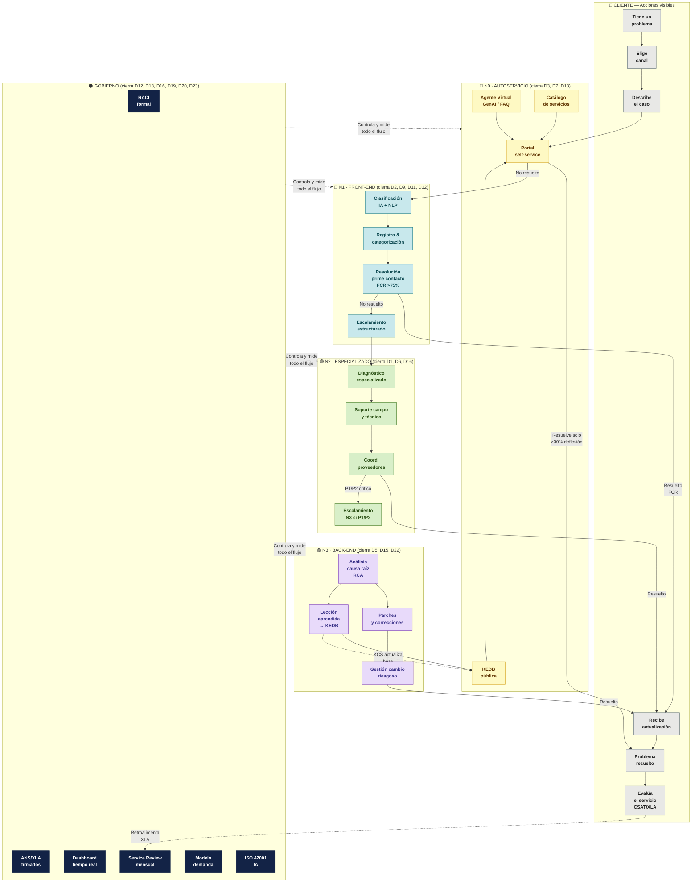
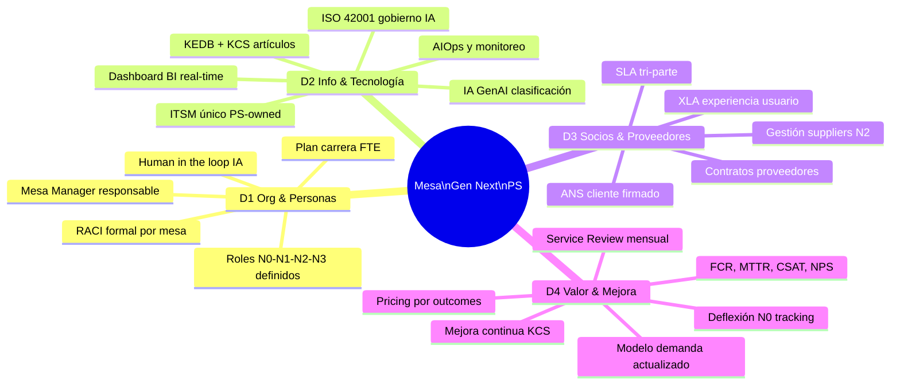

# Service Blueprint — Mesa de Servicios Next Gen
**PersonalSoft · ITIL v5 · Diseño orientado a cerrar los 21 dolores del levantamiento Julio 2026**

---

> **Cómo leer este Blueprint:**  
> Cada carril representa una capa del servicio. Las líneas de visibilidad separan lo que el cliente ve (sobre la línea) de lo que ocurre internamente (bajo la línea). Cada acción está mapeada contra el dolor que resuelve (D1–D20).

---

## 🗺️ Vista completa del Blueprint



---

## 🏊 Vista por Carriles — Blueprint Completo

```mermaid
flowchart LR
    classDef phys fill:#E8E8E6,stroke:#5B6B73,color:#222,font-size:11px
    classDef vis fill:#C8E8EC,stroke:#20808D,color:#0f4a52,font-size:11px
    classDef back fill:#D8EFC8,stroke:#437A22,color:#2d5217,font-size:11px
    classDef supp fill:#E8DAFA,stroke:#7A39BB,color:#3C3489,font-size:11px
    classDef gov fill:#1C2D5E,stroke:#132346,color:#fff,font-size:11px
    classDef line fill:none,stroke:#B3261E,stroke-width:2,stroke-dasharray:6
    classDef pain fill:#FAECE7,stroke:#B3261E,color:#B3261E,font-size:9px

    subgraph ETAPA["Etapas del Ciclo de Servicio →"]
        E1["1️⃣\nDESCUBRI-\nMIENTO"]
        E2["2️⃣\nSOLICITUD\nINGRESO"]
        E3["3️⃣\nCLASIFICA-\nCIÓN"]
        E4["4️⃣\nRESOLUCIÓN\nN0"]
        E5["5️⃣\nRESOLUCIÓN\nN1"]
        E6["6️⃣\nESCALAMIENTO\nN2"]
        E7["7️⃣\nELEVACIÓN\nN3"]
        E8["8️⃣\nCIERRE &\nCONOCIMIENTO"]
        E9["9️⃣\nMEDICIÓN &\nMEJORA"]
    end

    subgraph CL["👤 CLIENTE"]
        direction LR
        CL1["Descubre\ncanales PS"]:::phys
        CL2["Abre ticket\no portal"]:::phys
        CL3["Describe\nel problema"]:::phys
        CL4["Autogestión\nportal"]:::phys
        CL5["Recibe\nrespuesta N1"]:::phys
        CL6["Derivado\na experto"]:::phys
        CL7["Derivado\na back-end"]:::phys
        CL8["Confirma\nsolución"]:::phys
        CL9["Evalúa CSAT\nXLA survey"]:::phys
    end

    subgraph VIS["👁️ LÍNEA DE VISIBILIDAD — El cliente ve"]
        direction LR
        V1["Catálogo\npúblico"]:::vis
        V2["Portal /\nWhatsApp /\nEmail"]:::vis
        V3["Confirmación\nautomática"]:::vis
        V4["KEDB /\nAgente IA"]:::vis
        V5["Analista\nN1 visible"]:::vis
        V6["Status\nupdate"]:::vis
        V7["ETA\ncomunicada"]:::vis
        V8["Resolución\ndocumentada"]:::vis
        V9["Dashboard\nXLA cliente"]:::vis
    end

    subgraph BACK["🔧 BACKSTAGE — El cliente no ve"]
        direction LR
        B1["Modelo de\ndemanda\n+ FTE plan"]:::back
        B2["NLP clasif.\nautomática\nIA"]:::back
        B3["Motor\nenrutamiento\nIA"]:::back
        B4["KEDB +\nIA generativa\ndeflexión"]:::back
        B5["Registro ITSM\nKCS + SLA\ntimer"]:::back
        B6["Diagnóstico\nespecializado\nSME"]:::back
        B7["RCA /\nParches /\nCambios"]:::back
        B8["Lección\naprendida\narticulo"]:::back
        B9["Análisis\ntendencias\nAIOps"]:::back
    end

    subgraph SUP["⚙️ SOPORTE — Sistemas y herramientas"]
        direction LR
        S1["CRM /\nCommercial\nKit"]:::supp
        S2["ITSM\nHelix / SN /\nJira SD"]:::supp
        S3["IA Engine\nGPT-4o /\nClaude"]:::supp
        S4["KEDB / KCS\nConfluence"]:::supp
        S5["ITSM +\nSLA monitor"]:::supp
        S6["Herramienta\nespecializada\ncliente"]:::supp
        S7["Sandbox /\nDev env"]:::supp
        S8["KEDB\nfeedback\nloop"]:::supp
        S9["BI / Power BI\nDatadog\nDynatrace"]:::supp
    end

    subgraph GOV2["🏛️ GOBIERNO ITIL v5 — Horizontal"]
        direction LR
        G1["RACI\nfirmado\n→D12,D13"]:::gov
        G2["ANS/XLA\nvalidado\n→D2"]:::gov
        G3["Catálogo\nservicios\n→D15"]:::gov
        G4["Modelo\ndemanda\n→D20"]:::gov
        G5["Human-in\nloop IA\nISO 42001"]:::gov
        G6["Service\nReview\nmensual"]:::gov
        G7["Plan carrera\nFTE\n→D1"]:::gov
        G8["KPI real-time\ndashboard\n→D7"]:::gov
    end

    E1 --> E2 --> E3 --> E4 --> E5 --> E6 --> E7 --> E8 --> E9
```



---

## 📋 Detalle por Etapa — Qué resuelve cada acción

### Etapa 1 · Descubrimiento y entrada al servicio

| Acción | Actor | Dolor que cierra | ITIL v5 práctica |
|--------|-------|:----------------:|-----------------|
| Publicar catálogo de servicios en portal | PS / Mesa Manager | **D15** Catálogo desactualizado | Service Catalogue Mgmt |
| Definir canales oficiales (portal, WA, email, tel) | PS | **D3** Sin autoservicio | Service Desk |
| Documentar modelo de demanda y FTE | PS | **D20** Dimensionamiento sin modelo | Workforce Planning |
| Firmar Contrato Marco + SLA/XLA | PS + Cliente | **D2** SLAs incumplidos | SLM |

### Etapa 2 · Solicitud de ingreso — LÍNEA DE INTERACCIÓN

| Acción | Actor | Dolor que cierra | ITIL v5 práctica |
|--------|-------|:----------------:|-----------------|
| Portal autoservicio activo con IA (N0) | Sistema IA | **D3** Sin N0 | Service Desk |
| Chatbot GenAI clasifica y responde FAQ | Agente IA | **D7** Sin dashboard / D3 | Incident Mgmt |
| Email → ticket automático con categoría | Sistema | **D11** Postura reactiva | Incident Mgmt |
| Confirmación de recepción < 5 min | Sistema | **D2** SLA respuesta | SLM |

### Etapa 3 · Clasificación y priorización

| Acción | Actor | Dolor que cierra | ITIL v5 práctica |
|--------|-------|:----------------:|-----------------|
| NLP clasifica: Incidente / Req / Problema / Cambio | IA | **D9** Scope creep | Incident Mgmt |
| Priorización automática P1–P4 según impacto | IA + Analista | **D2** SLAs incumplidos | Incident Mgmt |
| SLA timer inicia al clasificar | Sistema | **D2** | SLM |
| Enrutamiento al nivel correcto (N0/N1/N2) | Motor IA | **D6** Escalamientos excesivos | Incident Mgmt |

### Etapa 4 · Resolución N0 — Autoservicio

| Acción | Actor | Dolor que cierra | ITIL v5 práctica |
|--------|-------|:----------------:|-----------------|
| Agente IA responde con artículo KEDB | IA + KEDB | **D3** Sin autoservicio | Knowledge Mgmt |
| Usuario resuelve solo (deflexión >30%) | Usuario | **D3**, **D7** | Service Desk |
| Si no resuelve → escala a N1 automático | Sistema | **D6** Escalamientos | Incident Mgmt |
| KEDB se actualiza con cada resolución (KCS) | Sistema | **D1** Bus factor / knowledge | Knowledge Mgmt |

### Etapa 5 · Resolución N1 — Front-end

| Acción | Actor | Dolor que cierra | ITIL v5 práctica |
|--------|-------|:----------------:|-----------------|
| Analista atiende con guía KEDB | Analista N1 | **D1** Bus factor | Knowledge Mgmt |
| Registro completo con categoría, impacto, CI | Analista N1 | **D7** Sin visibilidad | Incident Mgmt |
| FCR > 75% en primer contacto | Analista N1 | **D2** SLA resolución | Incident Mgmt |
| Escalamiento estructurado si no resuelve en SLA | Analista N1 | **D6** Escalamientos excesivos | Incident Mgmt |
| CSAT automático al cierre | Sistema | **D5** Baja satisfacción | SLM / XLA |

### Etapa 6 · Escalamiento N2 — Especializado

| Acción | Actor | Dolor que cierra | ITIL v5 práctica |
|--------|-------|:----------------:|-----------------|
| Diagnóstico especializado por SME | Coordinador N2 | **D1** Bus factor | Incident Mgmt |
| Coordinación con proveedores y terceros | Coordinador N2 | **D4** Herramientas fragmentadas | Supplier Mgmt |
| Actualización de estado al cliente c/30min | Coordinador N2 | **D7** Sin visibilidad | SLM |
| Cierre con documentación de solución | Coordinador N2 | **D16** Brechas conocimiento | Knowledge Mgmt |

### Etapa 7 · Elevación N3 — Back-end crítico

| Acción | Actor | Dolor que cierra | ITIL v5 práctica |
|--------|-------|:----------------:|-----------------|
| RCA obligatorio en P1 y P2 | Dev / SME | **D5** Sin causa raíz | Problem Mgmt |
| Parches o correcciones con cambio controlado | Dev | **D22** Modelo económico | Change Enablement |
| Gestión de cambio riesgoso con rollback | Dev + Coord. | **D2** SLA impacto | Change Enablement |
| Comunicación proactiva durante P1 | Mesa Manager | **D7** Sin visibilidad | SLM |

### Etapa 8 · Cierre y gestión del conocimiento

| Acción | Actor | Dolor que cierra | ITIL v5 práctica |
|--------|-------|:----------------:|-----------------|
| Artículo KCS creado en KEDB por cada P1/P2 | Analista/Dev | **D1** Bus factor · knowledge | Knowledge Mgmt |
| Lección aprendida alimenta N0 | Sistema KCS | **D3** Sin autoservicio | Knowledge Mgmt |
| Cierre formal con clasificación de causa | Analista | **D15** Catálogo / RCA | Incident Mgmt |
| Notificación de cierre al cliente | Sistema | **D2** Comunicación | SLM |

### Etapa 9 · Medición, gobierno y mejora continua

| Acción | Actor | Dolor que cierra | ITIL v5 práctica |
|--------|-------|:----------------:|-----------------|
| Dashboard en tiempo real: FCR, MTTR, SLA, CSAT | Sistema BI | **D7** Sin dashboard | Service Reporting |
| Service Review mensual con cliente (XLA) | Mesa Manager | **D16** Brechas vendido/ejecutado | SLM |
| Análisis de tendencias AIOps | IA + AIOps | **D5** Sin causa raíz | Problem Mgmt |
| Modelo de demanda actualizado mensualmente | Mesa Manager | **D20** Dimensionamiento | Workforce Planning |
| Human-in-the-loop para decisiones IA | Mesa Manager | Gobernanza ISO 42001 | IT Gov |
| Plan de carrera y reskilling FTE | PS / HR | **D18** Reskilling staff | People Mgmt |

---

## 🎯 Mapa de Dolores → Elemento del Blueprint

| # | Dolor levantado | Etapa que lo cierra | Elemento específico |
|---|----------------|:-------------------:|---------------------|
| D1 | Bus factor — conocimiento en pocas personas | 4, 8 | KEDB + KCS artículos por ticket |
| D2 | SLAs incumplidos / penalizaciones | 2, 3, 5 | ANS/XLA firmados + SLA timer automático |
| D3 | Sin autoservicio — todo por call/correo | 1, 2, 4 | Portal N0 + Agente IA GenAI |
| D4 | Herramientas fragmentadas | 6 | ITSM único PS-owned + integraciones |
| D5 | Baja satisfacción / sin causa raíz | 5, 7, 9 | CSAT/XLA automático + RCA obligatorio |
| D6 | Escalamientos excesivos | 3, 4, 5 | Enrutamiento IA + FCR > 75% en N1 |
| D7 | Sin dashboard ejecutivo | 5, 9 | Dashboard real-time BI + XLA report |
| D8 | Reportes manuales | 9 | BI automatizado + reporting API |
| D9 | Scope creep — alcance no controlado | 1, 3 | Catálogo firmado + clasificación NLP |
| D11 | Postura 100% reactiva | 2, 7, 9 | AIOps predictivo + N0 deflexión |
| D12 | Sin gobierno / RACI | 1, GOV | RACI formal firmado por mesa |
| D13 | Sin roles definidos N1/N2/N3 | 1, GOV | RACI + job descriptions + escalación |
| D14 | Penalización de eficiencia | 9 | KPIs de eficiencia en dashboard |
| D15 | Catálogo desactualizado | 1, 8 | Catálogo vivo revisado mensualmente |
| D16 | Brechas vendido vs ejecutado | 1, 6, 9 | Modelo demanda + Service Review XLA |
| D17 | Sin métricas / desalineación KPIs | 9 | FCR · MTTR · SLA · CSAT en real-time |
| D18 | Reskilling constante del staff | GOV | Plan carrera + KEDB como soporte |
| D19 | Asignación por perfil, no por modelo | 1, GOV | Modelo de demanda estandarizado |
| D20 | Dimensionamiento sin modelo | 1, GOV | Modelo FTE basado en volumetría |
| D23 | Recargo jornada (BCO/XM) | GOV | ANS con jornadas y recargos explícitos |

---

## 🏛️ Capas de Gobierno — ITIL v5 · 4 Dimensiones



---

## 📐 SLA por Prioridad — Meta Gen Next

| Prioridad | Definición | Respuesta | Resolución | Notificación |
|:---------:|-----------|:---------:|:----------:|:------------:|
| **P1 Crítico** | Servicio caído · Impacto masivo | 15 min | 1 hora | Cada 30 min |
| **P2 Alto** | Degradación significativa | 30 min | 4 horas | Cada 1 hora |
| **P3 Medio** | Afecta parcialmente | 2 horas | 8 horas | Al escalar |
| **P4 Bajo** | Sin impacto inmediato | 4 horas | 24 horas | Al cerrar |
| **N0 Autoservicio** | Usuario resuelve solo | < 30 seg IA | Inmediato | N/A |

---

## 💡 Diferenciadores vs Modelo Actual (antes/después)

| Dimensión | Modelo Actual (N1-N2) | Mesa Gen Next (N3+) |
|-----------|----------------------|---------------------|
| **Entrada** | Call / correo / presencial | Portal N0 + IA + omnicanal |
| **Clasificación** | Manual — criterio experto | IA NLP automática en < 30 seg |
| **Conocimiento** | En la cabeza del analista | KEDB + KCS accesible 24x7 |
| **Métricas** | Sin medición / manual | FCR · MTTR · CSAT · XLA en real-time |
| **Gobierno** | Sin RACI · sin ANS formal PS | RACI firmado · XLA · Service Review |
| **Dimensionamiento** | Criterio experto individual | Modelo de demanda basado en datos |
| **Escalamiento** | Rebotes sin criterio | Enrutamiento IA estructurado |
| **Reporting** | Excel manual · sin visibilidad | Dashboard BI automatizado |
| **Precios** | Por FTE | Evolución a por ticket → outcome |
| **Satisfacción** | Sin CSAT formal | CSAT + XLA + NPS automatizado |

---

## 🖊️ Prompt para replicar en Miro

```
Crea un Service Blueprint profesional para una Mesa de Servicios de Nueva Generación con IA en Miro. Sigue estas instrucciones exactas:

TÍTULO: "Service Blueprint — Mesa de Servicios Next Gen · PersonalSoft · ITIL v5"

ESTRUCTURA — 9 CARRILES HORIZONTALES (swimlanes) de arriba hacia abajo:

1. ETAPAS DEL CICLO (fila gris oscuro, texto blanco, negrita):
   Descubrimiento → Ingreso → Clasificación → N0 Autoservicio → N1 Front-end → N2 Especializado → N3 Back-end → Cierre/Conocimiento → Medición/Mejora

2. CARRIL CLIENTE (color: #E8E8E6, borde #5B6B73):
   Acciones visibles del cliente en cada etapa. Usar íconos de persona.
   - Descubre canales → Abre ticket o portal → Describe problema → Autogestión portal → Recibe respuesta N1 → Derivado a experto → Derivado a back-end → Confirma solución → Evalúa CSAT/XLA

3. LÍNEA DE INTERACCIÓN (línea azul sólida, label "LÍNEA DE INTERACCIÓN ──────")

4. CARRIL FRONT-STAGE / LÍNEA DE VISIBILIDAD (color: #C8E8EC, borde #20808D):
   Lo que el cliente ve del servicio:
   - Catálogo público → Portal/WA/Email → Confirmación automática → KEDB/Agente IA → Analista N1 visible → Status update → ETA comunicada → Resolución documentada → Dashboard XLA cliente

5. LÍNEA DE VISIBILIDAD (línea verde sólida, label "LÍNEA DE VISIBILIDAD ──────")

6. CARRIL BACKSTAGE (color: #D8EFC8, borde #437A22):
   Acciones internas invisibles para el cliente:
   - Modelo de demanda → NLP clasificación IA → Motor enrutamiento IA → KEDB + IA deflexión → Registro ITSM + KCS + SLA timer → Diagnóstico especializado SME → RCA / Parches / Cambios → Lección aprendida artículo → Análisis tendencias AIOps

7. LÍNEA DE SOPORTE (línea morada punteada, label "LÍNEA DE SOPORTE - - - -")

8. CARRIL SOPORTE / SISTEMAS (color: #E8DAFA, borde #7A39BB):
   Herramientas y sistemas de apoyo:
   - CRM/Commercial Kit → ITSM (Helix/SN/Jira) → IA Engine (GPT-4o/Claude) → KEDB/KCS/Confluence → ITSM + SLA monitor → Herramienta especializada cliente → Sandbox/Dev env → KEDB feedback loop → BI/Power BI/Datadog/Dynatrace

9. CARRIL GOBIERNO (color: #132346, texto blanco, horizontal al fondo):
   Un solo carril que corre debajo de todos: "GOBIERNO ITIL v5 — RACI · ANS/XLA · Catálogo · Modelo demanda · Human-in-loop IA ISO 42001 · Service Review mensual · Plan carrera FTE · KPI dashboard"

ELEMENTOS ADICIONALES:
- Entre cada etapa, conectar los carriles con flechas verticales grises
- Donde hay escalamiento (N1→N2→N3), usar flechas de color #B3261E (rojo) con label "Escala si SLA vence"
- Donde hay retroalimentación (KEDB→N0), usar flechas curvas punteadas verdes con label "KCS → KEDB"
- En cada acción del carril BACKSTAGE, agregar un badge pequeño en rojo con el código del dolor que resuelve (D1, D2, D3... etc)

LEYENDA (esquina inferior derecha):
- 🟦 Carril Cliente
- 🟩 Front-stage (visible)
- 🟢 Back-stage (invisible)
- 🟣 Soporte / Sistemas
- ⬛ Gobierno
- 🔴 Punto de falla actual (dolores D1-D20)
- ➡️ Flujo normal
- 🔴➡️ Escalamiento
- 🔁 Retroalimentación KCS

COLORES DE ETAPAS (header de columna):
- Descubrimiento: #5B6B73
- Ingreso: #20808D  
- Clasificación: #437A22
- N0: #085041
- N1: #0C447C
- N2: #437A22
- N3: #7A39BB
- Cierre: #1B474D
- Medición: #132346

NOTA DE PIE: "PersonalSoft · Mesa de Servicios Next Gen · ITIL v5 · Diseñado para cerrar los 21 dolores identificados en levantamiento Julio 2026"

El Blueprint debe verse como un diagrama de proceso profesional de consultoría — limpio, legible, con suficiente espacio entre carriles. Tamaño sugerido del canvas: 4000px × 2000px.
```

---

*Documento generado por PersonalSoft · Julio 2026 · Basado en: levantamiento de 11 mesas · ITIL v5 · Modelo de Madurez PS · Transcripts: Elsy Marin (SURA) · Michael Arévalo (AES) · Diego Serna (XM) · Virginia & Lina (BCO)*
