# Service Blueprint — Mesa de Servicios Next Gen
**PersonalSoft · ITIL v5 · Diseño orientado a cerrar los 21 dolores del levantamiento Julio 2026**

---

> **Cómo leer este Blueprint:**  
> El diseño parte del **Diagrama de Bloques del Servicio** (nivel 0) y se desglosa hacia abajo: bloques → doble catálogo → arquitectura de conocimiento (5 KDBs) → capas mínimas de plataforma → carriles del blueprint. Las líneas de visibilidad separan lo que el cliente ve (sobre la línea) de lo que ocurre internamente (bajo la línea). Cada acción está mapeada contra el dolor que resuelve (D1–D20) y contra el bloque de construcción que la origina (B1–B8, K1–K5).

---

## 🧱 Nivel 0 del diseño — Diagrama de Bloques del Servicio

> **Este es el punto de partida de todo el diseño.** El servicio se compone de bloques de construcción con propiedad definida: **ámbar = dominio del Cliente**, **azul/morado = dominio PersonalSoft**, **coral = servicios complementarios**. Cada bloque se desglosa en las secciones siguientes y se conecta con los carriles del Blueprint.

<svg width="100%" viewBox="0 0 1440 900" xmlns="http://www.w3.org/2000/svg">
<text font-family="Segoe UI, Arial, sans-serif" font-weight="700" x="34" y="300" font-size="16" fill="#26215C" transform="rotate(-90 34 300)" text-anchor="middle">USUARIOS FINALES</text>
<line x1="48" y1="80" x2="48" y2="520" stroke="#26215C" stroke-width="2"/>
<path d="M48 300 L66 300" stroke="#26215C" stroke-width="2" marker-end="url(#arrB)"/>
<defs>
<marker id="arrB" markerWidth="9" markerHeight="9" refX="7" refY="4.5" orient="auto"><path d="M0,0 L9,4.5 L0,9 z" fill="#26215C"/></marker>
<marker id="arrA" markerWidth="9" markerHeight="9" refX="7" refY="4.5" orient="auto"><path d="M0,0 L9,4.5 L0,9 z" fill="#633806"/></marker>
<marker id="arrG" markerWidth="9" markerHeight="9" refX="7" refY="4.5" orient="auto"><path d="M0,0 L9,4.5 L0,9 z" fill="#085041"/></marker>
<marker id="arrP" markerWidth="9" markerHeight="9" refX="7" refY="4.5" orient="auto"><path d="M0,0 L9,4.5 L0,9 z" fill="#3C3489"/></marker>
</defs>
<rect x="72" y="80" width="150" height="440" rx="8" fill="#FAEEDA" stroke="#633806" stroke-width="1.5"/>
<text font-family="Segoe UI, Arial, sans-serif" font-weight="700" x="147" y="120" font-size="14" fill="#633806" text-anchor="middle">Flota de</text>
<text font-family="Segoe UI, Arial, sans-serif" font-weight="700" x="147" y="138" font-size="14" fill="#633806" text-anchor="middle">Agentes IA</text>
<text font-family="Segoe UI, Arial, sans-serif" font-weight="700" x="147" y="156" font-size="14" fill="#633806" text-anchor="middle">Funcionales</text>
<text font-family="Segoe UI, Arial, sans-serif" x="147" y="180" font-size="12" fill="#633806" text-anchor="middle">y asistentes</text>
<text font-family="Segoe UI, Arial, sans-serif" x="147" y="196" font-size="12" fill="#633806" text-anchor="middle">de solución</text>
<text font-family="Segoe UI, Arial, sans-serif" x="147" y="240" font-size="11" fill="#8a5a1e" text-anchor="middle">Conocen el negocio</text>
<text font-family="Segoe UI, Arial, sans-serif" x="147" y="256" font-size="11" fill="#8a5a1e" text-anchor="middle">y el producto</text>
<text font-family="Segoe UI, Arial, sans-serif" x="147" y="272" font-size="11" fill="#8a5a1e" text-anchor="middle">del cliente</text>
<text font-family="Segoe UI, Arial, sans-serif" x="147" y="480" font-size="10" fill="#8a5a1e" text-anchor="middle">Bloque B1</text>
<rect x="238" y="80" width="130" height="440" rx="8" fill="#E6F1FB" stroke="#0C447C" stroke-width="1.5"/>
<text font-family="Segoe UI, Arial, sans-serif" font-weight="700" x="303" y="130" font-size="15" fill="#0C447C" text-anchor="middle">Canales</text>
<text font-family="Segoe UI, Arial, sans-serif" x="303" y="156" font-size="12" fill="#0C447C" text-anchor="middle">Cliente</text>
<text font-family="Segoe UI, Arial, sans-serif" x="303" y="172" font-size="12" fill="#0C447C" text-anchor="middle">PersonalSoft</text>
<text font-family="Segoe UI, Arial, sans-serif" x="303" y="220" font-size="11" fill="#2d6096" text-anchor="middle">Portal · chat</text>
<text font-family="Segoe UI, Arial, sans-serif" x="303" y="236" font-size="11" fill="#2d6096" text-anchor="middle">WhatsApp · correo</text>
<text font-family="Segoe UI, Arial, sans-serif" x="303" y="252" font-size="11" fill="#2d6096" text-anchor="middle">teléfono · API/AIOps</text>
<text font-family="Segoe UI, Arial, sans-serif" x="303" y="480" font-size="10" fill="#2d6096" text-anchor="middle">Bloque B2</text>
<rect x="384" y="80" width="140" height="440" rx="8" fill="#FFFFFF" stroke="#633806" stroke-width="1.5" stroke-dasharray="6 3"/>
<text font-family="Segoe UI, Arial, sans-serif" font-weight="700" x="454" y="130" font-size="14" fill="#633806" text-anchor="middle">Catálogo de</text>
<text font-family="Segoe UI, Arial, sans-serif" font-weight="700" x="454" y="148" font-size="14" fill="#633806" text-anchor="middle">Servicios</text>
<text font-family="Segoe UI, Arial, sans-serif" font-weight="700" x="454" y="172" font-size="14" fill="#633806" text-anchor="middle">&#171;Cliente&#187;</text>
<text font-family="Segoe UI, Arial, sans-serif" x="454" y="220" font-size="11" fill="#8a5a1e" text-anchor="middle">En el lenguaje y</text>
<text font-family="Segoe UI, Arial, sans-serif" x="454" y="236" font-size="11" fill="#8a5a1e" text-anchor="middle">herramienta</text>
<text font-family="Segoe UI, Arial, sans-serif" x="454" y="252" font-size="11" fill="#8a5a1e" text-anchor="middle">del cliente</text>
<text font-family="Segoe UI, Arial, sans-serif" x="454" y="480" font-size="10" fill="#8a5a1e" text-anchor="middle">Bloque B3</text>
<rect x="540" y="80" width="140" height="440" rx="8" fill="#3C3489" stroke="#26215C" stroke-width="1.5"/>
<text font-family="Segoe UI, Arial, sans-serif" font-weight="700" x="610" y="130" font-size="14" fill="#FFFFFF" text-anchor="middle">Catálogo de</text>
<text font-family="Segoe UI, Arial, sans-serif" font-weight="700" x="610" y="148" font-size="14" fill="#FFFFFF" text-anchor="middle">Servicios</text>
<text font-family="Segoe UI, Arial, sans-serif" font-weight="700" x="610" y="172" font-size="14" fill="#FFFFFF" text-anchor="middle">&#171;Proxy&#187;</text>
<text font-family="Segoe UI, Arial, sans-serif" x="610" y="220" font-size="11" fill="#DDD9FA" text-anchor="middle">Traducción</text>
<text font-family="Segoe UI, Arial, sans-serif" x="610" y="236" font-size="11" fill="#DDD9FA" text-anchor="middle">normalizada PS</text>
<text font-family="Segoe UI, Arial, sans-serif" x="610" y="252" font-size="11" fill="#DDD9FA" text-anchor="middle">1 modelo operativo</text>
<text font-family="Segoe UI, Arial, sans-serif" x="610" y="268" font-size="11" fill="#DDD9FA" text-anchor="middle">para N mesas</text>
<text font-family="Segoe UI, Arial, sans-serif" x="610" y="480" font-size="10" fill="#DDD9FA" text-anchor="middle">Bloque B4</text>
<rect x="704" y="80" width="392" height="160" rx="8" fill="#EEEDFE" stroke="#3C3489" stroke-width="1.5"/>
<rect x="722" y="96" width="82" height="80" rx="6" fill="#E1F5EE" stroke="#085041" stroke-width="1.2"/>
<text font-family="Segoe UI, Arial, sans-serif" font-weight="700" x="763" y="130" font-size="13" fill="#085041" text-anchor="middle">Nivel 0</text>
<text font-family="Segoe UI, Arial, sans-serif" x="763" y="148" font-size="10" fill="#085041" text-anchor="middle">Autoservicio</text>
<rect x="816" y="96" width="82" height="80" rx="6" fill="#E1F5EE" stroke="#085041" stroke-width="1.2"/>
<text font-family="Segoe UI, Arial, sans-serif" font-weight="700" x="857" y="130" font-size="13" fill="#085041" text-anchor="middle">Nivel 1</text>
<text font-family="Segoe UI, Arial, sans-serif" x="857" y="148" font-size="10" fill="#085041" text-anchor="middle">Front-end</text>
<rect x="910" y="96" width="82" height="80" rx="6" fill="#EEEDFE" stroke="#3C3489" stroke-width="1.2"/>
<text font-family="Segoe UI, Arial, sans-serif" font-weight="700" x="951" y="130" font-size="13" fill="#3C3489" text-anchor="middle">Nivel 2</text>
<text font-family="Segoe UI, Arial, sans-serif" x="951" y="148" font-size="10" fill="#3C3489" text-anchor="middle">Especializado</text>
<rect x="1004" y="96" width="82" height="80" rx="6" fill="#26215C" stroke="#26215C" stroke-width="1.2"/>
<text font-family="Segoe UI, Arial, sans-serif" font-weight="700" x="1045" y="130" font-size="13" fill="#FFFFFF" text-anchor="middle">Nivel 3</text>
<text font-family="Segoe UI, Arial, sans-serif" x="1045" y="148" font-size="10" fill="#FFFFFF" text-anchor="middle">Back-end</text>
<text font-family="Segoe UI, Arial, sans-serif" font-weight="700" x="900" y="222" font-size="14" fill="#3C3489" text-anchor="middle">Orquestador de Flujos de Casos · B5</text>
<rect x="704" y="270" width="392" height="86" rx="8" fill="#3C3489" stroke="#26215C" stroke-width="1.5"/>
<text font-family="Segoe UI, Arial, sans-serif" font-weight="700" x="900" y="304" font-size="15" fill="#FFFFFF" text-anchor="middle">Operación Aumentada · B6</text>
<text font-family="Segoe UI, Arial, sans-serif" x="900" y="326" font-size="12" fill="#DDD9FA" text-anchor="middle">Softers · Automatizaciones · Agentes de IA</text>
<rect x="704" y="386" width="392" height="70" rx="8" fill="#E1F5EE" stroke="#085041" stroke-width="1.5"/>
<text font-family="Segoe UI, Arial, sans-serif" font-weight="700" x="900" y="416" font-size="15" fill="#085041" text-anchor="middle">KPI Eficiencia Operativa · B7</text>
<text font-family="Segoe UI, Arial, sans-serif" x="900" y="436" font-size="11" fill="#085041" text-anchor="middle">FCR · MTTR · Deflexión · SLA/XLA · Costo/ticket</text>
<rect x="1120" y="80" width="180" height="440" rx="8" fill="#FAECE7" stroke="#712B13" stroke-width="1.5"/>
<text font-family="Segoe UI, Arial, sans-serif" font-weight="700" x="1210" y="130" font-size="14" fill="#712B13" text-anchor="middle">Servicios</text>
<text font-family="Segoe UI, Arial, sans-serif" font-weight="700" x="1210" y="148" font-size="14" fill="#712B13" text-anchor="middle">Complementarios</text>
<text font-family="Segoe UI, Arial, sans-serif" x="1210" y="196" font-size="11" fill="#8a4a30" text-anchor="middle">Assessment madurez</text>
<text font-family="Segoe UI, Arial, sans-serif" x="1210" y="214" font-size="11" fill="#8a4a30" text-anchor="middle">Modernización apps</text>
<text font-family="Segoe UI, Arial, sans-serif" x="1210" y="232" font-size="11" fill="#8a4a30" text-anchor="middle">Capacitaciones</text>
<text font-family="Segoe UI, Arial, sans-serif" x="1210" y="250" font-size="11" fill="#8a4a30" text-anchor="middle">Plan carrera</text>
<text font-family="Segoe UI, Arial, sans-serif" x="1210" y="268" font-size="11" fill="#8a4a30" text-anchor="middle">Gestión conocimiento</text>
<text font-family="Segoe UI, Arial, sans-serif" x="1210" y="286" font-size="11" fill="#8a4a30" text-anchor="middle">Seguridad</text>
<text font-family="Segoe UI, Arial, sans-serif" x="1210" y="304" font-size="11" fill="#8a4a30" text-anchor="middle">DevOps / Automatiz.</text>
<text font-family="Segoe UI, Arial, sans-serif" x="1210" y="322" font-size="11" fill="#8a4a30" text-anchor="middle">Performance eng.</text>
<text font-family="Segoe UI, Arial, sans-serif" x="1210" y="340" font-size="11" fill="#8a4a30" text-anchor="middle">Gobierno de datos</text>
<text font-family="Segoe UI, Arial, sans-serif" x="1210" y="358" font-size="11" fill="#8a4a30" text-anchor="middle">Gobierno de IA</text>
<text font-family="Segoe UI, Arial, sans-serif" x="1210" y="480" font-size="10" fill="#8a4a30" text-anchor="middle">Bloque B8</text>
<path d="M222 300 L236 300" stroke="#633806" stroke-width="2" marker-end="url(#arrA)"/>
<path d="M368 300 L382 300" stroke="#0C447C" stroke-width="2" marker-end="url(#arrB)"/>
<path d="M524 300 L538 300" stroke="#633806" stroke-width="2" marker-end="url(#arrA)"/>
<path d="M680 300 L702 300" stroke="#3C3489" stroke-width="2" marker-end="url(#arrP)"/>
<path d="M1096 300 L1118 300" stroke="#712B13" stroke-width="2" stroke-dasharray="5 4"/>
<text font-family="Segoe UI, Arial, sans-serif" x="1107" y="290" font-size="9" fill="#712B13" text-anchor="middle">activa</text>
<path d="M900 240 L900 268" stroke="#3C3489" stroke-width="2" marker-end="url(#arrP)"/>
<path d="M860 268 L860 242" stroke="#3C3489" stroke-width="2" marker-end="url(#arrP)"/>
<path d="M900 356 L900 384" stroke="#085041" stroke-width="2" stroke-dasharray="4 3" marker-end="url(#arrG)"/>
<text font-family="Segoe UI, Arial, sans-serif" x="960" y="374" font-size="10" fill="#085041">mide</text>
<line x1="72" y1="560" x2="1300" y2="560" stroke="#3C3489" stroke-width="2" stroke-dasharray="8 4"/>
<text font-family="Segoe UI, Arial, sans-serif" font-weight="700" x="686" y="552" font-size="12" fill="#3C3489" text-anchor="middle">BUS DE CONOCIMIENTO — alimenta agentes, orquestador y deflexión N0</text>
<path d="M147 560 L147 522" stroke="#3C3489" stroke-width="1.5" stroke-dasharray="4 3" marker-end="url(#arrP)"/>
<path d="M900 560 L900 458" stroke="#3C3489" stroke-width="1.5" stroke-dasharray="4 3" marker-end="url(#arrP)"/>
<rect x="72" y="590" width="228" height="96" rx="8" fill="#FAEEDA" stroke="#633806" stroke-width="1.5"/>
<text font-family="Segoe UI, Arial, sans-serif" font-weight="700" x="186" y="626" font-size="13" fill="#633806" text-anchor="middle">KDB Procesos y Producto</text>
<text font-family="Segoe UI, Arial, sans-serif" x="186" y="646" font-size="10.5" fill="#8a5a1e" text-anchor="middle">Negocio · funcionalidad · reglas</text>
<text font-family="Segoe UI, Arial, sans-serif" x="186" y="662" font-size="10.5" fill="#8a5a1e" text-anchor="middle">Propiedad: Cliente</text>
<rect x="322" y="590" width="228" height="96" rx="8" fill="#FAEEDA" stroke="#633806" stroke-width="1.5"/>
<text font-family="Segoe UI, Arial, sans-serif" font-weight="700" x="436" y="626" font-size="13" fill="#633806" text-anchor="middle">KDB Procedimental</text>
<text font-family="Segoe UI, Arial, sans-serif" x="436" y="646" font-size="10.5" fill="#8a5a1e" text-anchor="middle">Procedimientos · políticas · formatos</text>
<text font-family="Segoe UI, Arial, sans-serif" x="436" y="662" font-size="10.5" fill="#8a5a1e" text-anchor="middle">Propiedad: Cliente</text>
<rect x="572" y="590" width="228" height="96" rx="8" fill="#E6F1FB" stroke="#0C447C" stroke-width="1.5"/>
<text font-family="Segoe UI, Arial, sans-serif" font-weight="700" x="686" y="626" font-size="13" fill="#0C447C" text-anchor="middle">KDB Operacional de TI</text>
<text font-family="Segoe UI, Arial, sans-serif" x="686" y="646" font-size="10.5" fill="#2d6096" text-anchor="middle">Problemas y soluciones recurrentes</text>
<text font-family="Segoe UI, Arial, sans-serif" x="686" y="662" font-size="10.5" fill="#2d6096" text-anchor="middle">Pronóstico SLA/OLA · Propiedad: PS</text>
<rect x="822" y="590" width="228" height="96" rx="8" fill="#E6F1FB" stroke="#0C447C" stroke-width="1.5"/>
<text font-family="Segoe UI, Arial, sans-serif" font-weight="700" x="936" y="626" font-size="13" fill="#0C447C" text-anchor="middle">KDB Deflection Tkt</text>
<text font-family="Segoe UI, Arial, sans-serif" x="936" y="646" font-size="10.5" fill="#2d6096" text-anchor="middle">Artículos self-service · agente N0</text>
<text font-family="Segoe UI, Arial, sans-serif" x="936" y="662" font-size="10.5" fill="#2d6096" text-anchor="middle">Deflexión por artículo · Propiedad: PS</text>
<rect x="1072" y="590" width="228" height="96" rx="8" fill="#EEEDFE" stroke="#3C3489" stroke-width="1.5"/>
<text font-family="Segoe UI, Arial, sans-serif" font-weight="700" x="1186" y="620" font-size="13" fill="#3C3489" text-anchor="middle">KDB SOX, Seguridad,</text>
<text font-family="Segoe UI, Arial, sans-serif" font-weight="700" x="1186" y="636" font-size="13" fill="#3C3489" text-anchor="middle">Regulatorio</text>
<text font-family="Segoe UI, Arial, sans-serif" x="1186" y="656" font-size="10.5" fill="#3C3489" text-anchor="middle">Controles · evidencia · ISO 42001</text>
<text font-family="Segoe UI, Arial, sans-serif" x="1186" y="672" font-size="10.5" fill="#3C3489" text-anchor="middle">Propiedad: compartida</text>
<rect x="72" y="730" width="1228" height="120" rx="8" fill="#F1EFE8" stroke="#888780" stroke-width="1"/>
<text font-family="Segoe UI, Arial, sans-serif" font-weight="700" x="92" y="758" font-size="13" fill="#26215C">Leyenda de propiedad</text>
<rect x="92" y="774" width="22" height="14" rx="3" fill="#FAEEDA" stroke="#633806"/>
<text font-family="Segoe UI, Arial, sans-serif" x="122" y="785" font-size="12" fill="#412402">Dominio del Cliente (negocio, procedimientos, catálogo origen)</text>
<rect x="92" y="798" width="22" height="14" rx="3" fill="#E6F1FB" stroke="#0C447C"/>
<text font-family="Segoe UI, Arial, sans-serif" x="122" y="809" font-size="12" fill="#042C53">Dominio PersonalSoft (operación, conocimiento operacional, deflexión)</text>
<rect x="700" y="774" width="22" height="14" rx="3" fill="#EEEDFE" stroke="#3C3489"/>
<text font-family="Segoe UI, Arial, sans-serif" x="730" y="785" font-size="12" fill="#26215C">Orquestación · IA · gobierno (PS)</text>
<rect x="700" y="798" width="22" height="14" rx="3" fill="#FAECE7" stroke="#712B13"/>
<text font-family="Segoe UI, Arial, sans-serif" x="730" y="809" font-size="12" fill="#712B13">Servicios complementarios (venta sobre el servicio base)</text>
<text font-family="Segoe UI, Arial, sans-serif" x="92" y="836" font-size="11" fill="#5B6B73">PersonalSoft · Diagrama de Bloques del Servicio · Mesa de Servicios Next Gen · ITIL v5</text>
</svg>

### Desglose bloque a bloque

| # | Bloque | Qué es | Propiedad | Dolores que cierra | Se desglosa en |
|---|--------|--------|:---------:|:------------------:|----------------|
| **B1** | **Flota de Agentes IA Funcionales y asistentes de solución** | Agentes que conocen el negocio y el producto del cliente; primer punto de contacto inteligente del usuario final. Consumen las KDB Procesos y Producto + Procedimental | Cliente-facing, operada por PS | D3, D1, D11 | Sección *N0 Especializado — Banking & Energy Radar* |
| **B2** | **Canales (Cliente / PersonalSoft)** | Omnicanalidad: portal, chat, WhatsApp, correo, teléfono, API/AIOps. Pueden ser canales del cliente o provistos por PS | Mixta | D3, D4 | Capa 1 de las *Capas Mínimas de Plataforma* |
| **B3** | **Catálogo de Servicios «Cliente»** | El catálogo tal como el cliente lo conoce: su lenguaje, sus tipologías, su herramienta | Cliente | D15 | Sección *Doble Catálogo* |
| **B4** | **Catálogo de Servicios «Proxy»** | Traducción normalizada de PS: mapea cada servicio del cliente a los bloques estándar de la mesa (tipologías, prioridades, SLA, flujos). Es la clave de la industrialización: un solo modelo operativo para N mesas heterogéneas | **PS — activo diferenciador** | D9, D15, D16 | Sección *Doble Catálogo* |
| **B5** | **Orquestador de Flujos de Casos (N0–N3)** | Motor que decide y gobierna el flujo de cada caso a través de los 4 niveles. Se implementa con el orquestador central + 5 agentes especializados (triaje, diagnóstico, desarrollo, testing, AIOps+conocimiento) | PS | D6, D2, D13 | Diagrama principal del Blueprint + *Modelo Shift-Left* |
| **B6** | **Operación Aumentada** | Softers + automatizaciones + agentes de IA trabajando junto a los analistas humanos. Human-in-the-loop bajo ISO 42001 | PS | D1, D4, D18 | *FTE + Agentes IA — Modelo de Migración* y *Framework de Automatización N2* |
| **B7** | **KPI Eficiencia Operativa** | Medición transversal en tiempo real: FCR, MTTR, deflexión, SLA/XLA, costo/ticket | PS | D7, D8, D17 | *Modelo Shift-Left — Métricas* y carril Gobierno |
| **B8** | **Servicios Complementarios** | Portafolio que se vende sobre el servicio base y acelera la madurez de la mesa | PS | D5, D11, D18 | *Catálogo Modular — Servicios Complementarios* |
| **K1–K5** | **Arquitectura de Conocimiento (5 KDBs)** | El conocimiento deja de ser una KEDB única: se separa en 5 bases con propiedad y propósito distintos | Mixta (ver sección) | D1, D3, D15 | Sección *Arquitectura de Conocimiento — 5 KDBs* |

---

## 🔀 Doble Catálogo — «Cliente» y «Proxy»

El diseño introduce un patrón de **catálogo proxy** que resuelve el problema estructural de operar mesas heterogéneas (BCO con Helix, XM con ServiceNow, SURA con sus tipologías propias) con un único modelo:

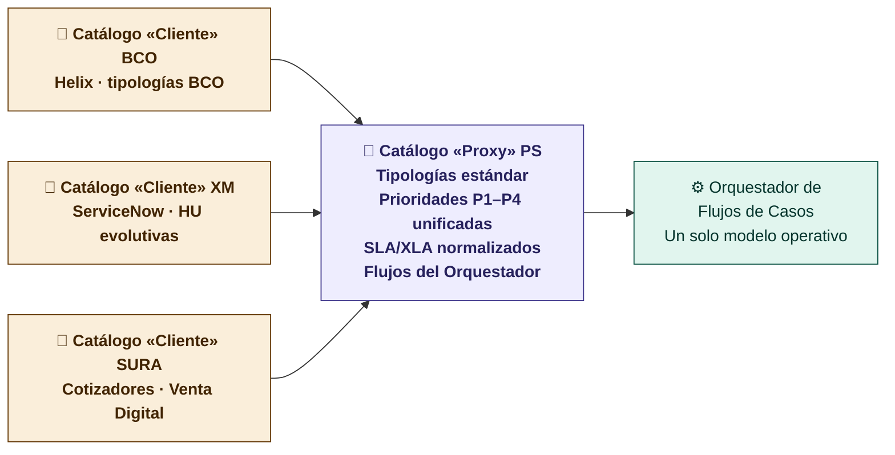

| Aspecto | Catálogo «Cliente» | Catálogo «Proxy» |
|---------|-------------------|------------------|
| **Lenguaje** | El del cliente (sus tipologías, sus nombres) | Estándar PS (bloques del servicio) |
| **Herramienta** | ITSM del cliente (Helix, SN, Jira) | Capa de mapeo PS — tool-agnostic |
| **Propiedad** | Cliente | PersonalSoft (activo de productización) |
| **Cambia cuando** | El cliente cambia su negocio | PS evoluciona el modelo (versionado) |
| **Valor** | Continuidad y cero fricción de adopción | Industrialización: onboarding de una mesa nueva = mapear su catálogo al Proxy, no rediseñar el servicio |
| **Dolores** | D15 (catálogo vivo por cliente) | D9 (scope controlado), D16 (vendido = ejecutado), D20 (volumetría comparable entre mesas) |

> **Regla de oro:** ningún caso entra al Orquestador sin pasar por el Proxy. Si un servicio del cliente no mapea a un bloque estándar, es una señal de scope creep (D9) o de un servicio complementario a cotizar (B8).

---

## 🗄️ Arquitectura de Conocimiento — 5 KDBs

> **Evolución clave del diseño:** la KEDB única del modelo anterior se separa en **5 bases de conocimiento con propiedad, propósito y ciclo de vida distintos**. Esto resuelve operativamente la decisión abierta sobre *a quién pertenece el conocimiento construido en la mesa*.

| KDB | Contenido | Alimenta a | Propiedad | Se nutre de |
|-----|-----------|-----------|:---------:|-------------|
| **K1 · Procesos y Producto** | Conocimiento del negocio: procesos, funcionalidades, reglas de negocio del cliente | Flota de Agentes IA Funcionales (B1) · N0 | **Cliente** (curada por PS) | Documentación del cliente · onboarding de la mesa |
| **K2 · Procedimental** | Cómo se hacen las cosas en el cliente: procedimientos, instructivos, políticas, formatos | Agentes funcionales · N1 | **Cliente** | Levantamiento inicial · actualizaciones del cliente |
| **K3 · Operacional de TI** | Conocimiento acumulado de la gestión PS sobre los activos de TI gestionados: problemas recurrentes y sus soluciones, pronóstico de cumplimiento SLA/OLA, patrones de deflección | Orquestador (B5) · N1/N2/N3 · AIOps | **PersonalSoft — activo diferenciador** | KCS: cada ticket cerrado · PIR de P1/P2 |
| **K4 · Deflection Tkt** | Artículos y flujos diseñados para desviar tickets a N0: FAQ, guías self-service, respuestas del agente virtual, con **medición de deflexión por artículo** | Agente N0 · Portal | **PersonalSoft** | K3 destilada para usuario final · analítica de tickets repetitivos |
| **K5 · SOX, Seguridad, Regulatorio** | Controles SOX, evidencias de cumplimiento, trazabilidad de decisiones IA (ISO 42001), normativa sectorial (SFC, CREG, Supersalud) | Gobierno · auditorías · human-in-the-loop | **Compartida** (evidencia auditable para ambos) | Radar regulatorio · auditoría IA · change enablement |

### Respuesta a la decisión abierta #7 — ¿De quién es el conocimiento?

| Tipo de conocimiento | Pertenece a | Racional |
|---------------------|:-----------:|----------|
| Del negocio y sus procedimientos (K1, K2) | **Cliente** | Es su negocio; PS lo cura pero no lo posee. Se entrega al cliente al finalizar el contrato |
| Del método operacional PS (K3, K4) | **PersonalSoft** | Es el *cómo* de PS: patrones cross-cliente anonimizados, pronósticos, framework de deflexión. Es lo que hace escalable y vendible la mesa |
| Regulatorio y de cumplimiento (K5) | **Compartida** | Ambas partes necesitan la evidencia; se define custodia y acceso en el contrato marco |

> **Implicación comercial:** K3 y K4 son el activo que se aprecia con cada mesa nueva — cada cliente hace más inteligente al siguiente (con datos anonimizados y cláusulas de confidencialidad). Esto debe quedar explícito en el contrato marco y en el kit comercial.

### Ciclo de vida — cómo se conectan las 5 KDBs con KCF

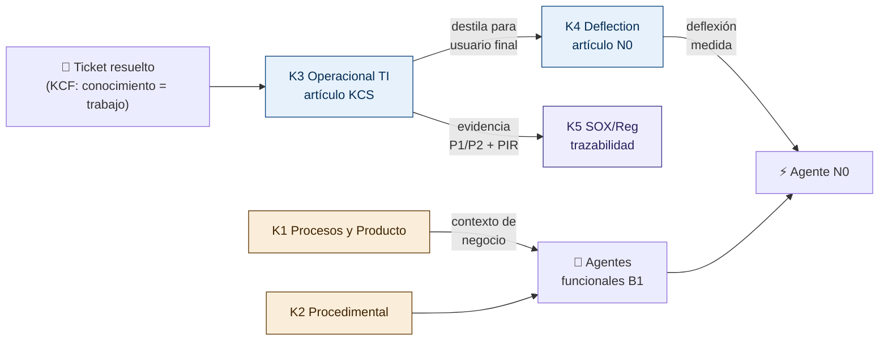

---

## 🧬 Capas Mínimas de Plataforma — Tool-agnostic

> **Principio:** operar, medir y automatizar **sin amarrar al cliente a una herramienta única**. Estas 8 capas son el contrato mínimo de plataforma de toda mesa Next Gen; cada capa admite la herramienta del cliente o la de PS, siempre que cumpla la función.

| # | Capa | Función mínima | Opciones de implementación | Bloque que soporta |
|---|------|----------------|---------------------------|:------------------:|
| 1 | **Canales** | Entrada omnicanal unificada | Portal, chat, WhatsApp, correo, teléfono, API/AIOps | B2 |
| 2 | **ITSM / CMDB** | Ticketing, SLA timer, CIs | ServiceNow, BMC Helix, Jira SM, ADO, ManageEngine o herramienta propia PS | B5 |
| 3 | **Framework de Automatizaciones** | Runbooks ejecutables para mesas de soporte Nivel 2 | Framework PS (runbooks codificados) | B6 |
| 4 | **Gestión del Conocimiento** | Las 5 KDBs vivas con ciclo KCS | KEDB, KCS, Confluence, SharePoint, artículos generados por IA | K1–K5 |
| 5 | **Plan Carrera** | Promoción del equipo de soporte por etapas (N1→N2→N3→KE) | Modelo PS de crecimiento + reskilling | B6 · cierra D18 |
| 6 | **IA / AIOps** | Agent assist, NLP, observabilidad, correlación, runbooks | GenAI (GPT-4o/Claude), Dynatrace, Datadog | B1, B5, B6 |
| 7 | **Gobierno** | Dashboards, SLA/XLA, CSAT, auditoría IA, cumplimiento | BI real-time + Service Review + ISO 42001 | B7 |
| 8 | **Seguridad** | SSO/IAM, VPN, cifrado, backup | ISO 27001 / ISO 42001 | Transversal · K5 |

> Estas capas definen además el **checklist de onboarding** de una mesa nueva: si el cliente ya cubre una capa con su herramienta, se integra; si no, PS la provee. En ningún caso la mesa opera con una capa ausente.

---

## 🗺️ Vista completa del Blueprint

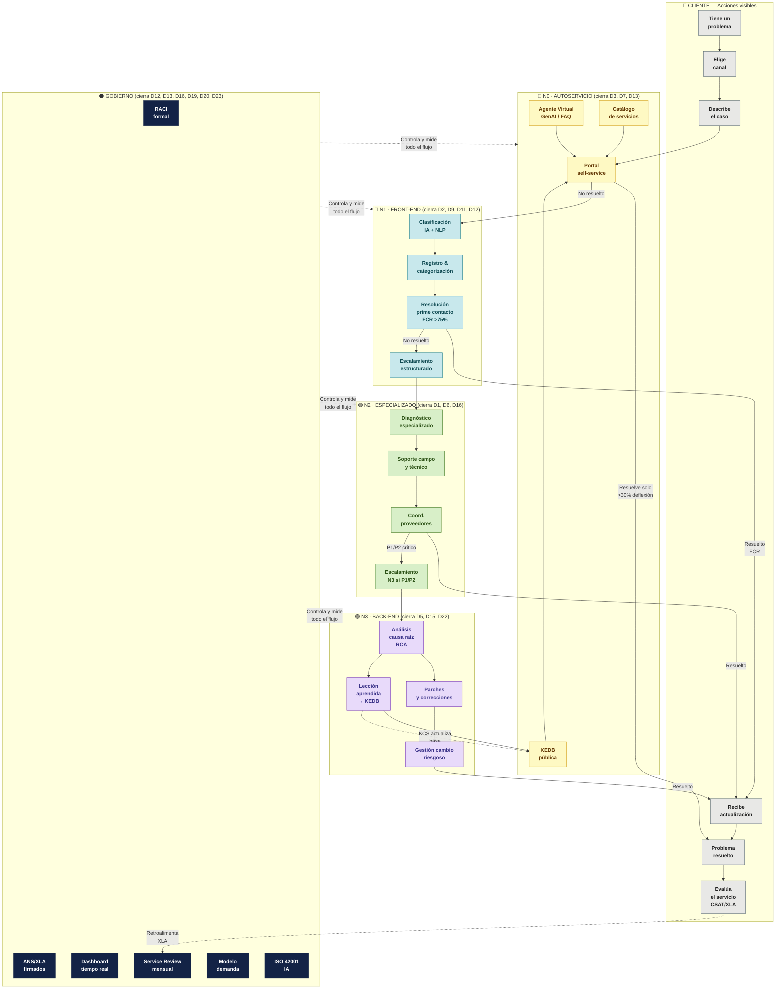

---


---

## 🎯 Visión del Servicio — Mesa Gen Next con KCF + IA

> **KCF — Knowledge-Centered Fitness:** el conocimiento no es un documento separado, es parte del flujo de trabajo. Cada ticket resuelto genera, actualiza o confirma un artículo. El conocimiento vive donde vive el trabajo.

El servicio de nueva generación no es solo más rápido — es **más inteligente con el tiempo**. Cada interacción alimenta la base de conocimiento especializada por sector (banca, seguros, energía), y esa base retroalimenta los agentes IA, reduce el MTTR y desplaza carga hacia N0.

### Principios de diseño

| Principio | Descripción |
|-----------|-------------|
| **Shift-Left primero** | Resolver en el nivel más bajo posible. N0 > N1 > N2 > N3. Cada escalamiento es un costo y una oportunidad de mejora. |
| **KCF · Knowledge as work** | El conocimiento se crea mientras se trabaja, no después. Cada ticket cerrado = artículo revisado o creado. |
| **PIR sistémico** | Post-Incident Review obligatorio en P1/P2. Alimenta KEDB y previene recurrencia. |
| **IA como colaborador** | Los agentes IA aumentan al analista — no lo reemplazan en casos complejos. Human-in-the-loop en decisiones con impacto. |
| **Negocio-aware** | La mesa conoce el contexto del negocio del cliente: picos regulatorios (XM), campañas (SURA), releases (BCO). |

---

## 🏊 Diagrama principal — Blueprint completo con IA, KCF y Shift-Left

> *[Ver diagrama visual interactivo arriba en la conversación]*

---

## 📐 Modelo Shift-Left — Métricas y Objetivos

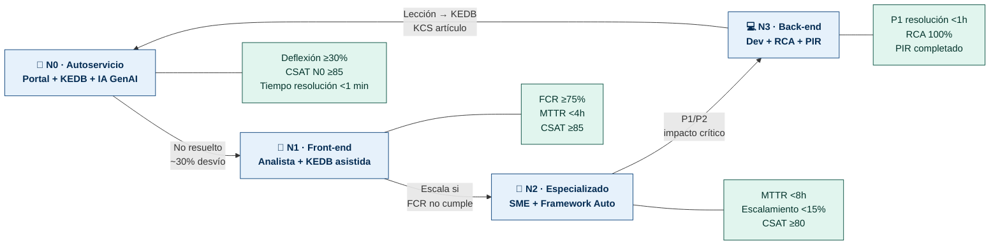

### Benchmarks de mercado — Impacto de Shift-Left con IA

| Métrica | Industria actual | Con IA + KCF | Fuente |
|---------|:----------------:|:------------:|--------|
| Deflexión N0 | 23% | **45–65%** | Gartner 2025 |
| FCR N1 | 74% | **82–88%** | HDI + KCS Society |
| MTTR promedio | 8.85h | **3.2–5.1h** | MetricNet 2024 |
| Reducción costo/ticket | — | **-26% a -40%** | Dynatrace Pulse 2026 |
| Artículos KCS por ticket | 0 | **1 por ticket** | KCS Academy |
| Tiempo onboarding nuevo analista | 90 días | **30–45 días** | KCS + KEDB especializada |
| Reincidencia de P1/P2 | ~35% | **<12%** | HDI Post-Incident Review |

---

## 🤖 FTE + Agentes IA — Modelo de Migración

```mermaid
flowchart TD
    classDef human fill:#E6F1FB,stroke:#0C447C,color:#042C53
    classDef agent fill:#FAEEDA,stroke:#633806,color:#412402,font-weight:bold
    classDef hybrid fill:#EEEDFE,stroke:#3C3489,color:#26215C
    classDef reduce fill:#E1F5EE,stroke:#085041,color:#04342C

    subgraph HOY["📍 HOY — Modelo actual N1-N2 (57 FTE PS)"]
        H1["👤 Analista N1\nTodo manual\nFCR ~50%"]:::human
        H2["👤 Analista N2\nDiagnóstico manual\nMTTR 12-24h"]:::human
        H3["👤 Dev N3\nRCA manual\nLección no capturada"]:::human
        H4["👤 Mesa Manager\nReportes manuales"]:::human
    end

    subgraph TRANSITION["⚙️ TRANSICIÓN — Wave 1-2 (0-12 meses)"]
        T1["👤+🤖 Analista N1\nAsistido por IA\nFCR sube a 75%"]:::hybrid
        T2["🤖 Agente clasificación\nNLP 24x7\nDesvía 30%+ a N0"]:::agent
        T3["👤+🤖 SME N2\nasistido por KEDB IA\nMTTR -30%"]:::hybrid
        T4["🤖 Agente monitoreo\nAIOps predictivo"]:::agent
    end

    subgraph GENNEXT["🚀 GEN NEXT — Modelo objetivo N3-N4 (12-24 meses)"]
        G1["🤖 Agente N0\nResolución autónoma\n45-65% tickets"]:::agent
        G2["👤 Analista N1 evolucionado\nCurador KEDB + casos complejos\nFCR >85%"]:::reduce
        G3["🤖 Agente diagnóstico N2\nAnálisis automático\n+ SME supervisión"]:::agent
        G4["👤 Knowledge Engineer\nGobierno IA + KEDB\n1 por cliente"]:::reduce
        G5["👤 Mesa Manager\nDashboard en tiempo real\nService Review XLA"]:::reduce
    end

    HOY --> TRANSITION --> GENNEXT

    NOTE1["📊 Reducción operacional estimada:\n• N1: 1 FTE por cada 150 tickets/mes desviados\n• N2: MTTR -30% = ~20% más capacidad\n• N3: PIR evita recurrencia = -35% P1/P2\n• Total: mismo volumen con -20 a -30% FTE en 24 meses"]:::reduce

    GENNEXT --> NOTE1
```

### Tabla de migración FTE → Agentes por nivel

| Nivel | FTE hoy (PS) | Agente IA | FTE objetivo | Rol FTE evolucionado |
|-------|:-----------:|:---------:|:------------:|---------------------|
| N0 Autoservicio | 0 | **Agente GenAI 24x7** | 0 FTE dedicado | — |
| N1 Front-end | ~24 FTE est. | **Agente clasificador + NLP** | ~16 FTE | Curador KCS + casos complejos |
| N2 Especializado | ~20 FTE est. | **Agente diagnóstico + RCA asistido** | ~16 FTE | SME supervisor de agentes |
| N3 Back-end | ~8 FTE est. | **Agente parches + testing** | ~6 FTE | Arquitecto de soluciones |
| Gobierno / KE | 0 | **Agente monitoreo AIOps** | **+4 FTE nuevos** | Knowledge Engineer + Gov IA |
| **Total** | **~57 FTE** | **5 agentes IA activos** | **~42 FTE** | **+capacidad sin agregar FTE** |

> **Nota:** La reducción no implica despidos — implica reabsorción en roles de mayor valor: Knowledge Engineers, Gov IA, Mesa Managers con capacidad analítica. El mismo equipo hace más con mejor calidad.

---

## 📚 PIR + KCS + IA — El ciclo virtuoso del conocimiento

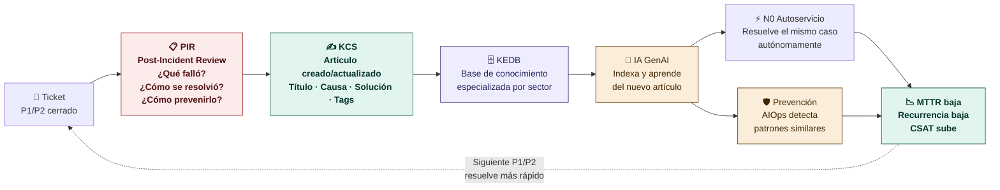

### Flujo PIR obligatorio (P1 y P2)

| Paso | Responsable | Tiempo máx. | Output |
|------|-------------|:-----------:|--------|
| 1. Incidente cerrado | Analista N2/N3 | — | Ticket con RCA preliminar |
| 2. PIR convocado | Mesa Manager | 24h post-cierre | Reunión 30 min máx |
| 3. 5 Whys documentados | SME | En la reunión | Causa raíz confirmada |
| 4. Artículo KCS creado | Analista autor | 2h post-PIR | Artículo en KEDB |
| 5. IA indexa artículo | Automático | <1h | Disponible en N0 |
| 6. Alerta preventiva | AIOps | En tiempo real | Detecta patrón similar |
| 7. Service Review | Mesa Manager | Próximo ciclo mensual | Lección en informe XLA |

---

## 🛠️ Herramientas por Nivel — Stack Tecnológico

| Nivel | Herramienta | Función | Propietario |
|-------|------------|---------|:-----------:|
| **N0** | Banking Solution Radar | Anticipar eventos regulatorios (ministerios, XM mercado eléctrico) | PS |
| **N0** | KDBs multiindustria (K1–K5) | Arquitectura de conocimiento de 5 bases especializadas por sector (banca, seguros, energía) — ver *Arquitectura de Conocimiento* | PS + Cliente |
| **N0** | AIOps Radar | Detectar comportamientos inusuales antes de que generen tickets | PS |
| **N0** | Agente GenAI (GPT-4o / Claude) | FAQ, clasificación, resolución autónoma de solicitudes simples | PS |
| **N1** | ITSM PS-owned (Helix/Jira SD) | Ticketing, SLA timer, enrutamiento, CSAT | PS |
| **N1** | Agente NLP clasificador | Categorización, priorización y asignación automática | PS |
| **N2** | Framework de Automatización PS | Runbooks, scripts, automatización de diagnósticos repetitivos | PS |
| **N2** | Herramienta especializada cliente | Acceso supervisado a sistemas del cliente (BCO: Helix, XM: SN) | Cliente |
| **N3** | Sandbox / Dev environment | Reproducción, parches, testing en entorno controlado | PS |
| **N3** | CI/CD Pipeline | Deploy controlado con Change Enablement | PS/Cliente |
| **GOB** | Dashboard BI (Power BI / Metabase) | KPIs real-time: FCR, MTTR, SLA, CSAT, deflexión N0 | PS |
| **GOB** | AIOps (Dynatrace / Datadog) | Monitoreo predictivo, correlación eventos, alertas proactivas | PS |
| **GOB** | ISO 42001 Gov IA | Gobierno de IA: human-in-loop, trazabilidad, auditoría | PS |

---

## ⚡ Automatizaciones y Agentes IA por Etapa

| Etapa del Blueprint | Automatización / Agente | Reducción estimada | Dolor que cierra |
|--------------------|------------------------|:-----------------:|-----------------|
| Ingreso multicanal | Bot omnicanal (WA/email/portal) | -70% tickets manuales de ingreso | D3 |
| Clasificación | NLP agent (categoría + prioridad) | -90% tiempo clasificación manual | D6, D9 |
| Deflexión N0 | GenAI + KEDB personalizada | -30 a 45% del volumen total | D3, D1 |
| Diagnóstico N1 | IA sugerencia artículo KEDB | -40% tiempo búsqueda del analista | D1, D7 |
| Escalamiento N1→N2 | Agente decide escalamiento | -60% escalamientos incorrectos | D6 |
| Diagnóstico N2 | Agente diagnóstico + runbook | -30% MTTR N2 | D4, D16 |
| Monitoreo proactivo | AIOps correlación + radar | -35% P1/P2 recurrentes | D5, D11 |
| Reporte XLA | BI auto-generado | -100% tiempo manual de reporte | D7, D8 |
| KCS artículo | IA sugiere borrador | -60% tiempo creación artículo | D1, D15 |
| Banking/Energy Radar | Anticipación regulatoria | P0 preventivos antes de P1 | D11 |

---

## 📦 Catálogo Modular de Servicios — Arquitectura de Servicio Integral

> El servicio se **vende y se cotiza por módulos**: una base gestionada + capacidades inmersas + servicios complementarios. Esta estructura es la que ve el kit comercial y la que mapea al Catálogo «Proxy» (B4).

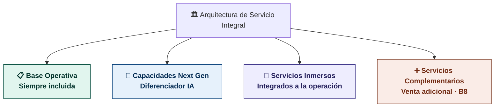

| Módulo | Naturaleza | Contenido | Modelo comercial |
|--------|-----------|-----------|------------------|
| **1 · Base Operativa** | Infraestructura fundamental y procesos centrales que garantizan estabilidad y continuidad — **siempre incluida** | Punto único de contacto · Gestión de incidentes · Gestión de solicitudes · ANS/SLA por prioridad · Reporte mensual | Incluido en el precio base (todo flavor: Dedicado, Compartido, Express/Alfa) |
| **2 · Capacidades Next Gen** | Innovación con foco en IA, automatización y escalabilidad — el **diferenciador** | Portal N0 y agente virtual · KEDB/KCS (5 KDBs) · Agent assist · AIOps y observabilidad · SLA + XLA + DEX | Incluido por nivel de flavor; profundidad crece de Express → Dedicado |
| **3 · Servicios Inmersos** | Funcionalidades integradas de forma nativa en la experiencia operativa | RACI y gobierno · Catálogo y alcance (Proxy) · Gestión de problemas · Disponibilidad · Change enablement · Mejora continua · Evolutivos | Inmersos en la operación — no se cotizan aparte, se dimensionan |
| **4 · Servicios Complementarios** | Portafolio adicional que acelera madurez y genera venta incremental | Ver catálogo detallado abajo (10 servicios) | Sprint-based o suscripción — se venden sobre el servicio base |

---

## 🧩 Servicios Complementarios (B8) — Portafolio detallado

> Módulo 4 del Catálogo Modular. Servicios adicionales que **aceleran la madurez** de la mesa y generan valor incremental. Se venden sobre el servicio base. El modelo de entrega es **sprint-based** o **suscripción mensual**. Alineado con el bloque **B8** del Diagrama de Bloques.

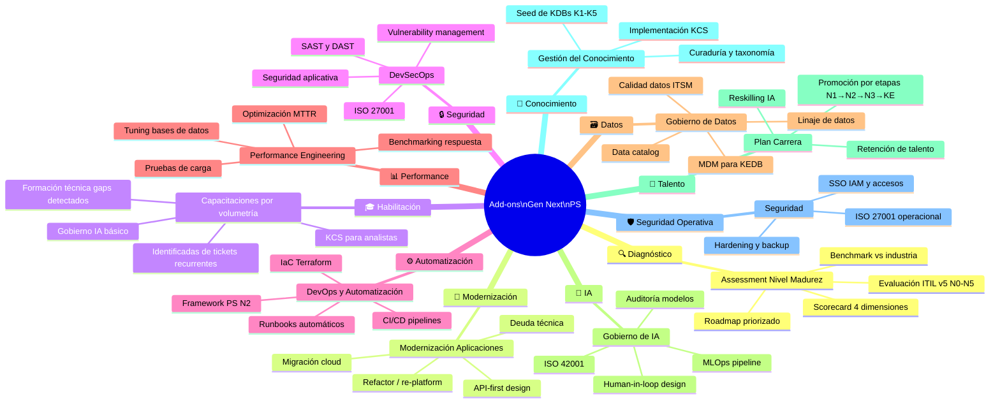

### Catálogo de Add-ons — Detalle

| Add-on | Descripción | Duración | Beneficio directo |
|--------|-------------|:--------:|------------------|
| **Assessment de Madurez** | Evaluación completa N0-N5 con scorecard ITIL v5, benchmarks de industria y roadmap priorizado | 2-4 semanas | Visibilidad del gap + plan de acción priorizado |
| **Modernización de Aplicaciones** | Migración, refactor o re-platform de apps identificadas con alto volumen de tickets en la mesa | Sprint-based | Reduce tickets recurrentes en N2/N3 en el largo plazo |
| **Capacitaciones por Volumetría** | Cursos técnicos para el equipo basados en los tickets más frecuentes — eliminan recurrencia desde el origen | 1-2 sem/módulo | -15 a -25% tickets repetitivos en 90 días |
| **DevSecOps / Seguridad** | SAST, DAST, análisis de vulnerabilidades, ISO 27001, seguridad de APIs | Sprint-based | Reduce incidentes de seguridad que llegan a la mesa |
| **Automatización & DevOps** | CI/CD, IaC, runbooks, automatización de procesos manuales identificados en la mesa | Sprint-based | Libera FTE N2 para trabajo de mayor valor |
| **Performance Engineering** | Pruebas de carga, tuning, optimización de respuesta de sistemas con alto MTTR | Sprint-based | Reduce MTTR en N2/N3 para apps críticas |
| **Gobierno de Datos** | Data catalog, linaje, calidad de datos ITSM, MDM para KEDB | 4-8 semanas | KEDB más precisa = IA más efectiva = FCR más alto |
| **Gobierno de IA** | ISO 42001, diseño human-in-loop, auditoría de modelos, MLOps | Continuo | Adopción IA segura y auditable en la mesa |
| **Plan Carrera** | Diseño e implementación del plan de promoción por etapas del equipo de soporte (N1→N2→N3→Knowledge Engineer) con reskilling en IA | 4-6 semanas + continuo | Cierra D18 · reduce rotación · crea camino de crecimiento (dolor de Fabio) |
| **Gestión del Conocimiento** | Implementación KCS, seed inicial de las 5 KDBs (K1–K5), curaduría, taxonomía y gobierno del conocimiento | 4-8 semanas | KDBs vivas desde el día 1 · acelera deflexión N0 y onboarding |
| **Seguridad** | SSO/IAM, gestión de accesos, hardening, backup, cumplimiento ISO 27001 operacional para la mesa | Sprint-based | Capa 8 de plataforma cubierta · reduce incidentes de acceso |

---

## 🏗️ N0 Especializado — Banking & Energy Radar

La capa N0 de la Mesa Next Gen no es un portal genérico. Está **especializada por sector** con inteligencia de contexto de negocio:

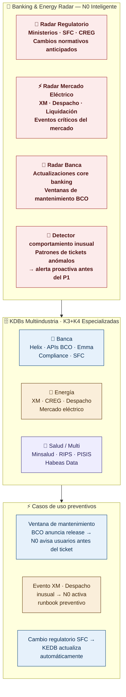

### Capacidades N0 por sector

| Sector | Fuente de inteligencia | Evento anticipado | Acción automática |
|--------|----------------------|------------------|------------------|
| **Banca (BCO)** | Core banking releases, ventanas mantenimiento | Release → pico de tickets N1 | Activa runbook, notifica usuarios, abre preventivo |
| **Seguros (SURA)** | Campañas de renovación, fechas pico suscripción | Agosto → pico Cotizadores | Escala FTE anticipado, activa base FAQ adicional |
| **Energía (XM)** | Calendario despacho CREG, liquidación mercado | Despacho inusual → alertas | Runbook especializado, notifica equipo 24x7 |
| **Regulatorio** | Ministerios, SFC, Supersalud, CREG | Cambio normativo | Actualiza KEDB + genera artículo KCS + alerta Mesa Manager |

---

## 🔄 N2 — Framework de Automatización PS

El Framework de Automatización PS es una capa de **runbooks codificados** que el agente N2 ejecuta antes de escalar a un SME humano:

| Categoría | Runbook | Tiempo ahorrado | Aplicable en |
|-----------|---------|:--------------:|-------------|
| Diagnóstico básico | Verificación servicios + logs automático | 45 min | Todas las mesas |
| Reinicio controlado | Reinicio de servicio con validación | 30 min | SURA Auto, XM |
| Limpieza de caché | Script caché + validación post | 20 min | BCO, SURA |
| Escalamiento de recursos | Autoscaling temporal cloud | 15 min | SURA VD, BCO |
| Rollback de cambio | Revertir último deploy | 60 min | N3 asistido |
| Alertas proactivas | Correlación métricas + AIOps | Previene P1 | XM, BCO |

---

## 📊 Antes vs Después — Modelo Operacional

| Dimensión | Modelo Actual (N1-N2) | Mesa Gen Next (N3+ con IA) | Evidencia |
|-----------|----------------------|--------------------------|-----------|
| **Entrada** | Call / correo / presencial | Portal N0 + IA + omnicanal 24x7 | KCF + Gartner |
| **Clasificación** | Manual · criterio experto | IA NLP < 30 seg · 95% precisión | Dynatrace 2026 |
| **Conocimiento** | En la cabeza del analista | KEDB + KCS · accesible 24x7 · sector-aware | KCS Academy |
| **Deflexión N0** | 0% (ninguna mesa) | 30–45% en 12 meses | HDI 2024 |
| **FCR N1** | ~50% estimado PS | **>75% objetivo** · >85% en 24m | MetricNet |
| **MTTR promedio** | 14.5h (SURA) | **<5h en 12m** · <3h en 24m | Dynatrace AI |
| **CSAT** | Sin medición formal | **>85 objetivo** · XLA por mesa | SQM Group |
| **Gobierno** | Sin RACI · sin ANS PS | RACI firmado · XLA · PIR sistemático | ITIL v5 |
| **FTE** | 57 FTE · tareas manuales | ~42 FTE + 5 agentes IA · más impacto | Estimado PS |
| **Onboarding analista** | 90 días | **30-45 días** con KEDB + IA asistida | KCS Society |
| **Reincidencia P1/P2** | ~35% sin PIR | **<12%** con PIR + KCS + AIOps | HDI PIR |
| **Precios** | Por FTE | **Por ticket → Outcome** en 18-24m | Gartner |

---

## 🎯 Roadmap de evolución del servicio

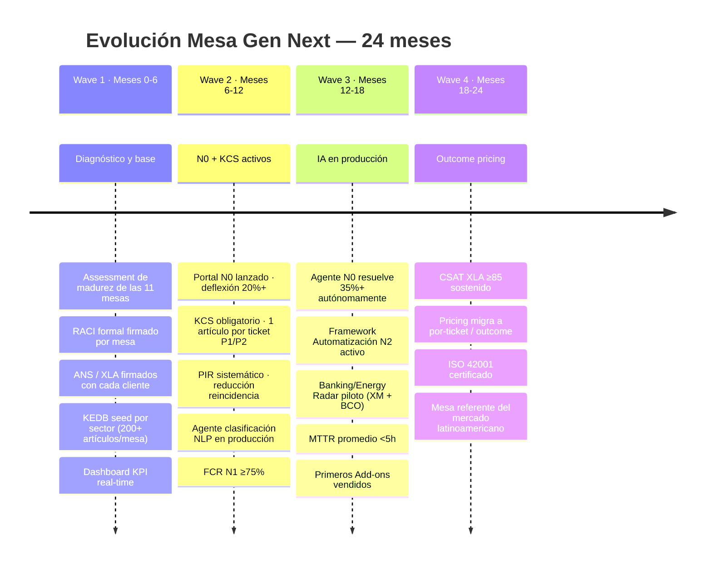

---

## 🖊️ Prompt para Miro — Blueprint completo

```
Crea un Service Blueprint profesional en Miro para la Mesa de Servicios Next Gen de PersonalSoft (ITIL v5). 

TÍTULO: "Service Blueprint — Mesa de Servicios Next Gen · PersonalSoft · ITIL v5 · KCF + Shift-Left + IA"

CANVAS: 4800px × 2800px. Organización: Banda superior con Diagrama de Bloques (100% ancho, 400px alto), Blueprint de carriles a la izquierda (60% del canvas), Add-ons y herramientas a la derecha (40%).

═══ BANDA SUPERIOR: DIAGRAMA DE BLOQUES DEL SERVICIO (Nivel 0) ═══

De izquierda a derecha, con label vertical "USUARIOS FINALES":
- B1 Flota de Agentes IA Funcionales (ámbar #FAEEDA borde #633806)
- B2 Canales Cliente/PersonalSoft (azul #E6F1FB borde #0C447C)
- B3 Catálogo «Cliente» (blanco, borde ámbar punteado)
- B4 Catálogo «Proxy» (morado #3C3489, texto blanco)
- B5 Orquestador de Flujos de Casos con 4 cajas internas Nivel 0/1/2/3 (contenedor #EEEDFE)
- B6 Operación Aumentada: Softers·Automatizaciones·Agentes IA (morado #3C3489)
- B7 KPI Eficiencia Operativa (verde #E1F5EE)
- B8 Servicios Complementarios (coral #FAECE7 borde #712B13)
Fila inferior — 5 KDBs sobre línea punteada "BUS DE CONOCIMIENTO":
K1 Procesos y Producto (ámbar·Cliente) | K2 Procedimental (ámbar·Cliente) | K3 Operacional de TI (azul·PS) | K4 Deflection Tkt (azul·PS) | K5 SOX/Seguridad/Regulatorio (morado·compartida)
Leyenda de propiedad: ámbar=Cliente, azul/morado=PersonalSoft, coral=complementarios.

═══ PARTE IZQUIERDA: BLUEPRINT DE CARRILES ═══

ESTRUCTURA — 6 CARRILES HORIZONTALES más header de etapas:

HEADER DE ETAPAS (negro #26215C, texto blanco, negrita):
1·Descubrimiento | 2·Ingreso | 3·Clasificación | 4·Resolución N0–N3 | 5·Cierre/KCS | 6·Medición

CARRIL 1 — CLIENTE (#888780 header, #F1EFE8 fondo):
Descubre canales → Abre ticket/portal → Describe problema → Autogestión N0 ó Recibe respuesta → Confirma solución → Evalúa CSAT/XLA

─── LÍNEA DE INTERACCIÓN (rojo sólido #E24B4A, 2px) ───

CARRIL 2 — FRONT-STAGE (#0F6E56 header, #E1F5EE fondo, cajas c-teal):
Catálogo público → Portal/WA/Email → Confirmación <5min → KEDB/Agente IA → Analista N1 visible → Dashboard XLA cliente

─── LÍNEA DE VISIBILIDAD (verde punteado #1D9E75, 1.5px dash 6-3) ───

CARRIL 3 — BACK-STAGE (#185FA5 header, #E6F1FB fondo):
Fila 1 (azul): Modelo demanda→D20 | NLP clasif.→D9,D6 | Enrutamiento IA→D6 | N0 KEDB+IA→D3,D1 | KCS artículo→D1,D3,D15 | Análisis AIOps→D5
Fila 2 (verde): Lección→KEDB (flecha curva retroalimenta N0) | N1 Analista FCR→D2,D5,D7 | N2 SME diag.→D4,D16 | CSAT auto→D5,D17 | Service Review XLA→D16,D17
Fila 3 (ámbar/rojo): N2 Framework Auto | N3 RCA+parche
FLECHAS DE ESCALAMIENTO N1→N2→N3 en rojo #E24B4A
FLECHA KCS retroalimenta N0 en morado punteado #534AB7

─── LÍNEA DE SOPORTE (morado punteado #534AB7, 1px dash 4-4) ───

CARRIL 4 — SOPORTE/SISTEMAS (#3C3489 header, #EEEDFE fondo, cajas c-purple):
CRM/Kit comercial | ITSM Helix/JiraSD | IA GPT-4o/Claude | KEDB/Confluence | SLA monitor | BI/Datadog/PowerBI
Segunda fila: SLA timer auto | NLP motor | KCS feedback loop | AIOps/Dynatrace

CARRIL 5 — GOBIERNO (#042C53 header, mismo color fondo, cajas azul #0C447C borde #378ADD texto blanco):
RACI formal→D12,D13 | ANS/XLA→D2,D23 | Catálogo activo→D9,D15 | Modelo demanda→D19,D20 | Human-in-loop IA ISO42001 | Service Review→D16,D17 | Plan carrera FTE→D1,D18

CARRIL 6 — SLA (oscuro, tabla de prioridades):
P1: resp 15min / resol 1h / notif c30min
P2: resp 30min / resol 4h / notif c1h
P3: resp 2h / resol 8h / notif al escalar
P4: resp 4h / resol 24h / notif al cerrar
N0 IA: resp <30seg / resol inmediato

═══ PARTE DERECHA: CONTEXTO Y PORTAFOLIO ═══

SECCIÓN 1 — Modelo Shift-Left (diagrama flujo N0→N1→N2→N3 con métricas):
- N0: Deflexión ≥30%, FCR N0 ≥85, <1min
- N1: FCR ≥75%, MTTR <4h, CSAT ≥85
- N2: MTTR <8h, Escalamiento <15%
- N3: P1 <1h, RCA 100%, PIR completado
Benchmarks en tabla: Deflexión 23%→45-65% | FCR 74%→82-88% | MTTR 8.85h→3.2-5.1h

SECCIÓN 2 — PIR + KCS + IA (ciclo virtuoso, flujo circular):
Ticket → PIR (24h) → KCS artículo (2h) → KEDB → IA indexa → N0 resuelve → MTTR baja → próximo ticket más rápido
Tabla de flujo PIR obligatorio P1/P2

SECCIÓN 3 — FTE → Agentes (tabla migración):
Hoy: 57 FTE manual / Transición: FTE+Agente híbrido / Gen Next: ~42 FTE + 5 agentes IA
Resaltar: mismo volumen con -20 a -30% FTE en 24 meses

SECCIÓN 4 — N0 Banking & Energy Radar:
Cuatro radares: Regulatorio (ministerios/SFC) | Mercado eléctrico (XM/CREG) | Core banking (BCO) | Detector inusual
KEDB multiindustria: Banca | Energía | Salud/Multi

SECCIÓN 5 — N2 Framework de Automatización:
Tabla runbooks: Diagnóstico 45min | Reinicio 30min | Caché 20min | Rollback 60min | AIOps preventivo

SECCIÓN 6 — Add-ons / Servicios complementarios (8 tarjetas):
🔍 Assessment Madurez · 📱 Modernización Apps · 🎓 Capacitaciones por volumetría
🔒 DevSecOps · ⚙️ Automatización DevOps · 📊 Performance Engineering  
🗃️ Gobierno Datos · 🤖 Gobierno IA ISO 42001

═══ ESTILO VISUAL ═══
Colores por carril: gris cliente / teal front-stage / azul back-stage / morado soporte / azul oscuro gobierno
Cajas con border-radius 4px. Sin sombras. Texto 13-14px máximo.
Badges rojos "→D20" en cada acción de back-stage mostrando el dolor que cierra.
Flechas de escalamiento N1→N2→N3 en rojo #E24B4A con label "Escala si SLA vence".
Flecha curva retroalimentación KCS→N0 en morado punteado.
Footer: "PersonalSoft · Mesa de Servicios Next Gen · ITIL v5 · KCF + Shift-Left + IA · Basado en levantamiento 11 mesas Julio 2026"
```

---

*PersonalSoft · Service Blueprint v3.0 · Julio 2026 · Basado en: 11 mesas levantadas · ITIL v5 · KCF · Shift-Left · PIR · IA GenAI · Dynatrace Pulse 2026 · MetricNet 2024 · HDI · KCS Society*


---

## 🏊 Vista por Carriles — Blueprint Completo

```mermaid
flowchart LR
    classDef phys fill:#E8E8E6,stroke:#5B6B73,color:#222,font-size:11px
    classDef vis fill:#C8E8EC,stroke:#20808D,color:#0f4a52,font-size:11px
    classDef back fill:#D8EFC8,stroke:#437A22,color:#2d5217,font-size:11px
    classDef supp fill:#E8DAFA,stroke:#7A39BB,color:#3C3489,font-size:11px
    classDef gov fill:#1C2D5E,stroke:#132346,color:#fff,font-size:11px
    classDef line fill:none,stroke:#B3261E,stroke-width:2,stroke-dasharray:6
    classDef pain fill:#FAECE7,stroke:#B3261E,color:#B3261E,font-size:9px

    subgraph ETAPA["Etapas del Ciclo de Servicio →"]
        E1["1️⃣\nDESCUBRI-\nMIENTO"]
        E2["2️⃣\nSOLICITUD\nINGRESO"]
        E3["3️⃣\nCLASIFICA-\nCIÓN"]
        E4["4️⃣\nRESOLUCIÓN\nN0"]
        E5["5️⃣\nRESOLUCIÓN\nN1"]
        E6["6️⃣\nESCALAMIENTO\nN2"]
        E7["7️⃣\nELEVACIÓN\nN3"]
        E8["8️⃣\nCIERRE &\nCONOCIMIENTO"]
        E9["9️⃣\nMEDICIÓN &\nMEJORA"]
    end

    subgraph CL["👤 CLIENTE"]
        direction LR
        CL1["Descubre\ncanales PS"]:::phys
        CL2["Abre ticket\no portal"]:::phys
        CL3["Describe\nel problema"]:::phys
        CL4["Autogestión\nportal"]:::phys
        CL5["Recibe\nrespuesta N1"]:::phys
        CL6["Derivado\na experto"]:::phys
        CL7["Derivado\na back-end"]:::phys
        CL8["Confirma\nsolución"]:::phys
        CL9["Evalúa CSAT\nXLA survey"]:::phys
    end

    subgraph VIS["👁️ LÍNEA DE VISIBILIDAD — El cliente ve"]
        direction LR
        V1["Catálogo\npúblico"]:::vis
        V2["Portal /\nWhatsApp /\nEmail"]:::vis
        V3["Confirmación\nautomática"]:::vis
        V4["KEDB /\nAgente IA"]:::vis
        V5["Analista\nN1 visible"]:::vis
        V6["Status\nupdate"]:::vis
        V7["ETA\ncomunicada"]:::vis
        V8["Resolución\ndocumentada"]:::vis
        V9["Dashboard\nXLA cliente"]:::vis
    end

    subgraph BACK["🔧 BACKSTAGE — El cliente no ve"]
        direction LR
        B1["Modelo de\ndemanda\n+ FTE plan"]:::back
        B2["NLP clasif.\nautomática\nIA"]:::back
        B3["Motor\nenrutamiento\nIA"]:::back
        B4["KEDB +\nIA generativa\ndeflexión"]:::back
        B5["Registro ITSM\nKCS + SLA\ntimer"]:::back
        B6["Diagnóstico\nespecializado\nSME"]:::back
        B7["RCA /\nParches /\nCambios"]:::back
        B8["Lección\naprendida\narticulo"]:::back
        B9["Análisis\ntendencias\nAIOps"]:::back
    end

    subgraph SUP["⚙️ SOPORTE — Sistemas y herramientas"]
        direction LR
        S1["CRM /\nCommercial\nKit"]:::supp
        S2["ITSM\nHelix / SN /\nJira SD"]:::supp
        S3["IA Engine\nGPT-4o /\nClaude"]:::supp
        S4["KEDB / KCS\nConfluence"]:::supp
        S5["ITSM +\nSLA monitor"]:::supp
        S6["Herramienta\nespecializada\ncliente"]:::supp
        S7["Sandbox /\nDev env"]:::supp
        S8["KEDB\nfeedback\nloop"]:::supp
        S9["BI / Power BI\nDatadog\nDynatrace"]:::supp
    end

    subgraph GOV2["🏛️ GOBIERNO ITIL v5 — Horizontal"]
        direction LR
        G1["RACI\nfirmado\n→D12,D13"]:::gov
        G2["ANS/XLA\nvalidado\n→D2"]:::gov
        G3["Catálogo\nservicios\n→D15"]:::gov
        G4["Modelo\ndemanda\n→D20"]:::gov
        G5["Human-in\nloop IA\nISO 42001"]:::gov
        G6["Service\nReview\nmensual"]:::gov
        G7["Plan carrera\nFTE\n→D1"]:::gov
        G8["KPI real-time\ndashboard\n→D7"]:::gov
    end

    E1 --> E2 --> E3 --> E4 --> E5 --> E6 --> E7 --> E8 --> E9
```

---

## 📋 Detalle por Etapa — Qué resuelve cada acción

### Etapa 1 · Descubrimiento y entrada al servicio

| Acción | Actor | Dolor que cierra | ITIL v5 práctica |
|--------|-------|:----------------:|-----------------|
| Publicar catálogo de servicios en portal | PS / Mesa Manager | **D15** Catálogo desactualizado | Service Catalogue Mgmt |
| Definir canales oficiales (portal, WA, email, tel) | PS | **D3** Sin autoservicio | Service Desk |
| Documentar modelo de demanda y FTE | PS | **D20** Dimensionamiento sin modelo | Workforce Planning |
| Firmar Contrato Marco + SLA/XLA | PS + Cliente | **D2** SLAs incumplidos | SLM |

### Etapa 2 · Solicitud de ingreso — LÍNEA DE INTERACCIÓN

| Acción | Actor | Dolor que cierra | ITIL v5 práctica |
|--------|-------|:----------------:|-----------------|
| Portal autoservicio activo con IA (N0) | Sistema IA | **D3** Sin N0 | Service Desk |
| Chatbot GenAI clasifica y responde FAQ | Agente IA | **D7** Sin dashboard / D3 | Incident Mgmt |
| Email → ticket automático con categoría | Sistema | **D11** Postura reactiva | Incident Mgmt |
| Confirmación de recepción < 5 min | Sistema | **D2** SLA respuesta | SLM |

### Etapa 3 · Clasificación y priorización

| Acción | Actor | Dolor que cierra | ITIL v5 práctica |
|--------|-------|:----------------:|-----------------|
| NLP clasifica: Incidente / Req / Problema / Cambio | IA | **D9** Scope creep | Incident Mgmt |
| Priorización automática P1–P4 según impacto | IA + Analista | **D2** SLAs incumplidos | Incident Mgmt |
| SLA timer inicia al clasificar | Sistema | **D2** | SLM |
| Enrutamiento al nivel correcto (N0/N1/N2) | Motor IA | **D6** Escalamientos excesivos | Incident Mgmt |

### Etapa 4 · Resolución N0 — Autoservicio

| Acción | Actor | Dolor que cierra | ITIL v5 práctica |
|--------|-------|:----------------:|-----------------|
| Agente IA responde con artículo KEDB | IA + KEDB | **D3** Sin autoservicio | Knowledge Mgmt |
| Usuario resuelve solo (deflexión >30%) | Usuario | **D3**, **D7** | Service Desk |
| Si no resuelve → escala a N1 automático | Sistema | **D6** Escalamientos | Incident Mgmt |
| KEDB se actualiza con cada resolución (KCS) | Sistema | **D1** Bus factor / knowledge | Knowledge Mgmt |

### Etapa 5 · Resolución N1 — Front-end

| Acción | Actor | Dolor que cierra | ITIL v5 práctica |
|--------|-------|:----------------:|-----------------|
| Analista atiende con guía KEDB | Analista N1 | **D1** Bus factor | Knowledge Mgmt |
| Registro completo con categoría, impacto, CI | Analista N1 | **D7** Sin visibilidad | Incident Mgmt |
| FCR > 75% en primer contacto | Analista N1 | **D2** SLA resolución | Incident Mgmt |
| Escalamiento estructurado si no resuelve en SLA | Analista N1 | **D6** Escalamientos excesivos | Incident Mgmt |
| CSAT automático al cierre | Sistema | **D5** Baja satisfacción | SLM / XLA |

### Etapa 6 · Escalamiento N2 — Especializado

| Acción | Actor | Dolor que cierra | ITIL v5 práctica |
|--------|-------|:----------------:|-----------------|
| Diagnóstico especializado por SME | Coordinador N2 | **D1** Bus factor | Incident Mgmt |
| Coordinación con proveedores y terceros | Coordinador N2 | **D4** Herramientas fragmentadas | Supplier Mgmt |
| Actualización de estado al cliente c/30min | Coordinador N2 | **D7** Sin visibilidad | SLM |
| Cierre con documentación de solución | Coordinador N2 | **D16** Brechas conocimiento | Knowledge Mgmt |

### Etapa 7 · Elevación N3 — Back-end crítico

| Acción | Actor | Dolor que cierra | ITIL v5 práctica |
|--------|-------|:----------------:|-----------------|
| RCA obligatorio en P1 y P2 | Dev / SME | **D5** Sin causa raíz | Problem Mgmt |
| Parches o correcciones con cambio controlado | Dev | **D22** Modelo económico | Change Enablement |
| Gestión de cambio riesgoso con rollback | Dev + Coord. | **D2** SLA impacto | Change Enablement |
| Comunicación proactiva durante P1 | Mesa Manager | **D7** Sin visibilidad | SLM |

### Etapa 8 · Cierre y gestión del conocimiento

| Acción | Actor | Dolor que cierra | ITIL v5 práctica |
|--------|-------|:----------------:|-----------------|
| Artículo KCS creado en KEDB por cada P1/P2 | Analista/Dev | **D1** Bus factor · knowledge | Knowledge Mgmt |
| Lección aprendida alimenta N0 | Sistema KCS | **D3** Sin autoservicio | Knowledge Mgmt |
| Cierre formal con clasificación de causa | Analista | **D15** Catálogo / RCA | Incident Mgmt |
| Notificación de cierre al cliente | Sistema | **D2** Comunicación | SLM |

### Etapa 9 · Medición, gobierno y mejora continua

| Acción | Actor | Dolor que cierra | ITIL v5 práctica |
|--------|-------|:----------------:|-----------------|
| Dashboard en tiempo real: FCR, MTTR, SLA, CSAT | Sistema BI | **D7** Sin dashboard | Service Reporting |
| Service Review mensual con cliente (XLA) | Mesa Manager | **D16** Brechas vendido/ejecutado | SLM |
| Análisis de tendencias AIOps | IA + AIOps | **D5** Sin causa raíz | Problem Mgmt |
| Modelo de demanda actualizado mensualmente | Mesa Manager | **D20** Dimensionamiento | Workforce Planning |
| Human-in-the-loop para decisiones IA | Mesa Manager | Gobernanza ISO 42001 | IT Gov |
| Plan de carrera y reskilling FTE | PS / HR | **D18** Reskilling staff | People Mgmt |

---

## 🎯 Mapa de Dolores → Elemento del Blueprint

| # | Dolor levantado | Etapa que lo cierra | Elemento específico |
|---|----------------|:-------------------:|---------------------|
| D1 | Bus factor — conocimiento en pocas personas | 4, 8 | KEDB + KCS artículos por ticket |
| D2 | SLAs incumplidos / penalizaciones | 2, 3, 5 | ANS/XLA firmados + SLA timer automático |
| D3 | Sin autoservicio — todo por call/correo | 1, 2, 4 | Portal N0 + Agente IA GenAI |
| D4 | Herramientas fragmentadas | 6 | ITSM único PS-owned + integraciones |
| D5 | Baja satisfacción / sin causa raíz | 5, 7, 9 | CSAT/XLA automático + RCA obligatorio |
| D6 | Escalamientos excesivos | 3, 4, 5 | Enrutamiento IA + FCR > 75% en N1 |
| D7 | Sin dashboard ejecutivo | 5, 9 | Dashboard real-time BI + XLA report |
| D8 | Reportes manuales | 9 | BI automatizado + reporting API |
| D9 | Scope creep — alcance no controlado | 1, 3 | Catálogo firmado + clasificación NLP |
| D11 | Postura 100% reactiva | 2, 7, 9 | AIOps predictivo + N0 deflexión |
| D12 | Sin gobierno / RACI | 1, GOV | RACI formal firmado por mesa |
| D13 | Sin roles definidos N1/N2/N3 | 1, GOV | RACI + job descriptions + escalación |
| D14 | Penalización de eficiencia | 9 | KPIs de eficiencia en dashboard |
| D15 | Catálogo desactualizado | 1, 8 | Catálogo vivo revisado mensualmente |
| D16 | Brechas vendido vs ejecutado | 1, 6, 9 | Modelo demanda + Service Review XLA |
| D17 | Sin métricas / desalineación KPIs | 9 | FCR · MTTR · SLA · CSAT en real-time |
| D18 | Reskilling constante del staff | GOV | Plan carrera + KEDB como soporte |
| D19 | Asignación por perfil, no por modelo | 1, GOV | Modelo de demanda estandarizado |
| D20 | Dimensionamiento sin modelo | 1, GOV | Modelo FTE basado en volumetría |
| D23 | Recargo jornada (BCO/XM) | GOV | ANS con jornadas y recargos explícitos |

---

## 🏛️ Capas de Gobierno — ITIL v5 · 4 Dimensiones

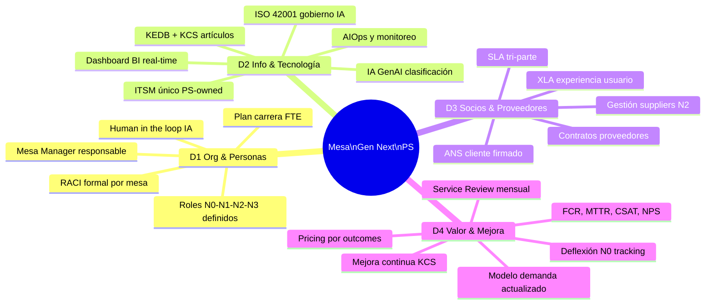

---

## 📐 SLA por Prioridad — Meta Gen Next

| Prioridad | Definición | Respuesta | Resolución | Notificación |
|:---------:|-----------|:---------:|:----------:|:------------:|
| **P1 Crítico** | Servicio caído · Impacto masivo | 15 min | 1 hora | Cada 30 min |
| **P2 Alto** | Degradación significativa | 30 min | 4 horas | Cada 1 hora |
| **P3 Medio** | Afecta parcialmente | 2 horas | 8 horas | Al escalar |
| **P4 Bajo** | Sin impacto inmediato | 4 horas | 24 horas | Al cerrar |
| **N0 Autoservicio** | Usuario resuelve solo | < 30 seg IA | Inmediato | N/A |

---

## 💡 Diferenciadores vs Modelo Actual (antes/después)

| Dimensión | Modelo Actual (N1-N2) | Mesa Gen Next (N3+) |
|-----------|----------------------|---------------------|
| **Entrada** | Call / correo / presencial | Portal N0 + IA + omnicanal |
| **Clasificación** | Manual — criterio experto | IA NLP automática en < 30 seg |
| **Conocimiento** | En la cabeza del analista | KEDB + KCS accesible 24x7 |
| **Métricas** | Sin medición / manual | FCR · MTTR · CSAT · XLA en real-time |
| **Gobierno** | Sin RACI · sin ANS formal PS | RACI firmado · XLA · Service Review |
| **Dimensionamiento** | Criterio experto individual | Modelo de demanda basado en datos |
| **Escalamiento** | Rebotes sin criterio | Enrutamiento IA estructurado |
| **Reporting** | Excel manual · sin visibilidad | Dashboard BI automatizado |
| **Precios** | Por FTE | Evolución a por ticket → outcome |
| **Satisfacción** | Sin CSAT formal | CSAT + XLA + NPS automatizado |

---

## 🖊️ Prompt para replicar en Miro

```
Crea un Service Blueprint profesional para una Mesa de Servicios de Nueva Generación con IA en Miro. Sigue estas instrucciones exactas:

TÍTULO: "Service Blueprint — Mesa de Servicios Next Gen · PersonalSoft · ITIL v5"

ESTRUCTURA — 9 CARRILES HORIZONTALES (swimlanes) de arriba hacia abajo:

1. ETAPAS DEL CICLO (fila gris oscuro, texto blanco, negrita):
   Descubrimiento → Ingreso → Clasificación → N0 Autoservicio → N1 Front-end → N2 Especializado → N3 Back-end → Cierre/Conocimiento → Medición/Mejora

2. CARRIL CLIENTE (color: #E8E8E6, borde #5B6B73):
   Acciones visibles del cliente en cada etapa. Usar íconos de persona.
   - Descubre canales → Abre ticket o portal → Describe problema → Autogestión portal → Recibe respuesta N1 → Derivado a experto → Derivado a back-end → Confirma solución → Evalúa CSAT/XLA

3. LÍNEA DE INTERACCIÓN (línea azul sólida, label "LÍNEA DE INTERACCIÓN ──────")

4. CARRIL FRONT-STAGE / LÍNEA DE VISIBILIDAD (color: #C8E8EC, borde #20808D):
   Lo que el cliente ve del servicio:
   - Catálogo público → Portal/WA/Email → Confirmación automática → KEDB/Agente IA → Analista N1 visible → Status update → ETA comunicada → Resolución documentada → Dashboard XLA cliente

5. LÍNEA DE VISIBILIDAD (línea verde sólida, label "LÍNEA DE VISIBILIDAD ──────")

6. CARRIL BACKSTAGE (color: #D8EFC8, borde #437A22):
   Acciones internas invisibles para el cliente:
   - Modelo de demanda → NLP clasificación IA → Motor enrutamiento IA → KEDB + IA deflexión → Registro ITSM + KCS + SLA timer → Diagnóstico especializado SME → RCA / Parches / Cambios → Lección aprendida artículo → Análisis tendencias AIOps

7. LÍNEA DE SOPORTE (línea morada punteada, label "LÍNEA DE SOPORTE - - - -")

8. CARRIL SOPORTE / SISTEMAS (color: #E8DAFA, borde #7A39BB):
   Herramientas y sistemas de apoyo:
   - CRM/Commercial Kit → ITSM (Helix/SN/Jira) → IA Engine (GPT-4o/Claude) → KEDB/KCS/Confluence → ITSM + SLA monitor → Herramienta especializada cliente → Sandbox/Dev env → KEDB feedback loop → BI/Power BI/Datadog/Dynatrace

9. CARRIL GOBIERNO (color: #132346, texto blanco, horizontal al fondo):
   Un solo carril que corre debajo de todos: "GOBIERNO ITIL v5 — RACI · ANS/XLA · Catálogo · Modelo demanda · Human-in-loop IA ISO 42001 · Service Review mensual · Plan carrera FTE · KPI dashboard"

ELEMENTOS ADICIONALES:
- Entre cada etapa, conectar los carriles con flechas verticales grises
- Donde hay escalamiento (N1→N2→N3), usar flechas de color #B3261E (rojo) con label "Escala si SLA vence"
- Donde hay retroalimentación (KEDB→N0), usar flechas curvas punteadas verdes con label "KCS → KEDB"
- En cada acción del carril BACKSTAGE, agregar un badge pequeño en rojo con el código del dolor que resuelve (D1, D2, D3... etc)

LEYENDA (esquina inferior derecha):
- 🟦 Carril Cliente
- 🟩 Front-stage (visible)
- 🟢 Back-stage (invisible)
- 🟣 Soporte / Sistemas
- ⬛ Gobierno
- 🔴 Punto de falla actual (dolores D1-D20)
- ➡️ Flujo normal
- 🔴➡️ Escalamiento
- 🔁 Retroalimentación KCS

COLORES DE ETAPAS (header de columna):
- Descubrimiento: #5B6B73
- Ingreso: #20808D  
- Clasificación: #437A22
- N0: #085041
- N1: #0C447C
- N2: #437A22
- N3: #7A39BB
- Cierre: #1B474D
- Medición: #132346

NOTA DE PIE: "PersonalSoft · Mesa de Servicios Next Gen · ITIL v5 · Diseñado para cerrar los 21 dolores identificados en levantamiento Julio 2026"

El Blueprint debe verse como un diagrama de proceso profesional de consultoría — limpio, legible, con suficiente espacio entre carriles. Tamaño sugerido del canvas: 4000px × 2000px.
```

---

*Documento PersonalSoft · Service Blueprint **v3.0** · Julio 2026 · Evolucionado desde el Diagrama de Bloques del Servicio (B1–B8, K1–K5) · Basado en: levantamiento de 11 mesas · ITIL v5 · Modelo de Madurez PS · Capas Mínimas de Plataforma · Catálogo Modular · Transcripts: Elsy Marin (SURA) · Michael Arévalo (AES) · Diego Serna (XM) · Virginia & Lina (BCO)*
