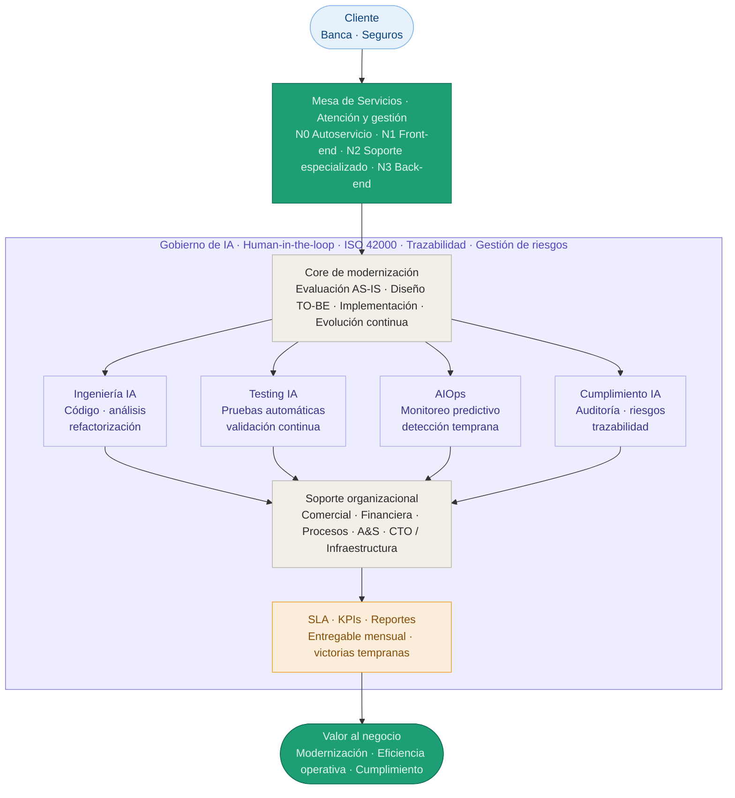

# Mesa de Servicios de Nueva Generación con IA
**PersonalSoft · Estrategia CTO / SICTO**

---

## Arquitectura del servicio

```mermaid
flowchart TD

%% Cliente
A([Cliente\nBanca · Seguros])

%% Capa 1 - Frontstage
B[Mesa de Servicios · Atención y gestión\nN0 Autoservicio · N1 Front-end · N2 Soporte especializado · N3 Back-end]

%% Capa 2 - Core
C[Core de modernización\nEvaluación AS-IS · Diseño TO-BE · Implementación · Evolución continua]

%% Capa 3 - IA modular
D1[Ingeniería IA\nCódigo · análisis\nrefactorización]
D2[Testing IA\nPruebas automáticas\nvalidación continua]
D3[AIOps\nMonitoreo predictivo\ndetección temprana]
D4[Cumplimiento IA\nAuditoría · riesgos\ntrazabilidad]

%% Capa 4 - Soporte
E[Soporte organizacional\nComercial · Financiera · Procesos · A&S · CTO / Infraestructura]

%% Capa 5 - Medición
F[SLA · KPIs · Reportes\nEntregable mensual · victorias tempranas]

%% Capa 6 - Valor
G([Valor al negocio\nModernización · Eficiencia operativa · Cumplimiento])

%% Flujo principal
A --> B
B --> C
C --> D1 & D2 & D3 & D4
D1 & D2 & D3 & D4 --> E
E --> F
F --> G

%% Gobierno de IA como subgraph envolvente
subgraph GOV [Gobierno de IA · Human-in-the-loop · ISO 42000 · Trazabilidad · Gestión de riesgos]
  C
  D1
  D2
  D3
  D4
  E
  F
end

%% Estilos
classDef cliente fill:#E6F1FB,stroke:#85B7EB,color:#0C447C
classDef frontstage fill:#1D9E75,stroke:#0F6E56,color:#E1F5EE
classDef core fill:#F1EFE8,stroke:#B4B2A9,color:#2C2C2A
classDef ia fill:#EEEDFE,stroke:#AFA9EC,color:#3C3489
classDef soporte fill:#F1EFE8,stroke:#B4B2A9,color:#2C2C2A
classDef medicion fill:#FAEEDA,stroke:#EF9F27,color:#854F0B
classDef valor fill:#1D9E75,stroke:#0F6E56,color:#E1F5EE
classDef gov fill:#EEEDFE,stroke:#7F77DD,color:#534AB7

class A cliente
class B frontstage
class C core
class D1,D2,D3,D4 ia
class E soporte
class F medicion
class G valor
class GOV gov
```
