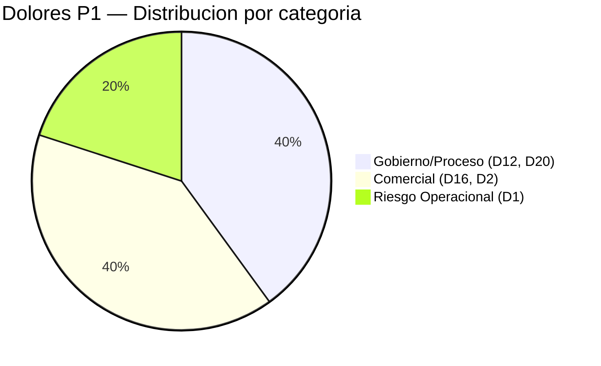
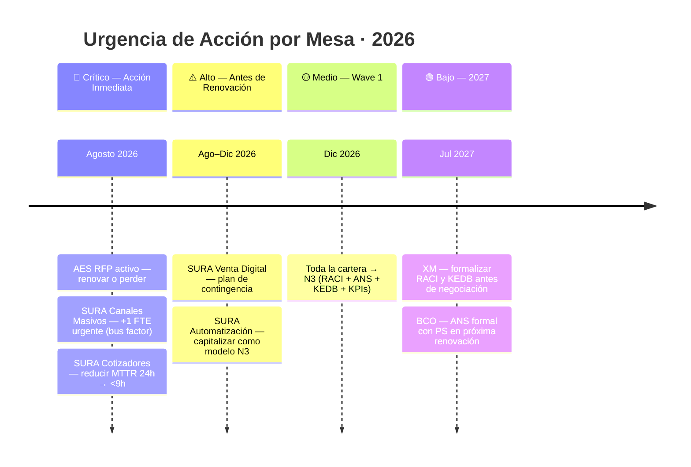

# 📊 Caracterización Completa de Mesas de Servicio - 2026

**Documento Confidencial - Análisis Estratégico de Mesas de Servicio**

**Fecha de Generación:** Julio 2026  
**Preparado por:** Natalia Zartha Suarez  
**Objeto:** Diseño e Implementación de Modelo Estandarizado de Mesas de Servicio


---

## 🗺️ Vista Ejecutiva — Mesas de Servicio PS · Julio 2026

> Las siguientes visualizaciones se renderizan en **Markdown Preview Enhanced** (VS Code). Para otras herramientas, ver las tablas equivalentes debajo de cada sección.

---

### 📍 Mapa de Niveles de Madurez

```mermaid
graph LR
    subgraph N1["🔴 N1 · Inicial · Sin Gobierno Estandarizado"]
        AES["AES<br/>Soporte IT/OT<br/>4 FTE · 8x5"]
        BCO1["BCO COES Integración<br/>7 FTE · ANS Banco"]
        BCO2["BCO COES Datos<br/>7 FTE · ANS Banco"]
        BCO3["BCO Soporte<br/>13 FTE · ANS Banco"]
        BCO4["BCO COES Emma<br/>4 FTE · ANS Banco"]
        BCO5["BCO Emma iSeries<br/>1 FTE · ANS Banco"]
    end

    subgraph N2["🔵 N2 · Administrado · Herramienta Activa"]
        SC["SURA Cotizadores<br/>8 FTE · 668 tix · SLA 70%🔴"]
        SVD["SURA Venta Digital<br/>2 FTE · 174 tix · SLA 74%🔴"]
        SA["SURA Automatización<br/>6 FTE · 512 tix · SLA 98%✅"]
        SCM["SURA Canales Masivos<br/>1 FTE · 171 tix · SLA 72%🔴"]
        XM["XM Apps Críticas<br/>4 FTE · 90 tix · 24x7"]
    end

    subgraph N3["🟢 N3 · Definido · Meta Wave 1 Dic 2026"]
        SC3["SURA Cotizadores<br/>Evolutivos plataforma"]
        XM3["XM<br/>HU Evolutivas"]
    end

    META["🎯 META<br/>Wave 1 · Dic 2026<br/>Todas las mesas → N3"]

    N1 --> N2
    N2 --> N3
    N3 --> META

    style N1 fill:#FEE2E2,stroke:#B3261E,color:#7F1D1D
    style N2 fill:#EBF0F8,stroke:#132346,color:#0D1B5E
    style N3 fill:#DCFCE7,stroke:#1F7A4D,color:#14532D
    style META fill:#132346,stroke:#132346,color:#FFFFFF
```



---

### 📊 Scorecard por Mesa — Estado Julio 2026

| Mesa | Cliente | Nivel | FTE | Tix/mes | MTTR | SLA | USD/tix | Jornada | Apps | Herramienta | Riesgo |
|------|---------|:-----:|:---:|:-------:|:----:|:---:|:-------:|:-------:|:----:|:-----------:|:------:|
| Cotizadores | SURA | 🔵 N2 | 8 | 668 | 24.58h 🔴 | 70% 🔴 | $40 | 8x5 | 1 plataforma | BMC Helix | ⚠️ Renovación ago |
| Venta Digital | SURA | 🔵 N2 | 2 | 174 | 12.38h 🟡 | 74% 🔴 | $39 | 8x5 | 1 portal | BMC Helix | ⚠️ Renovación ago |
| Automatización | SURA | 🔵 N2 | 6 | 512 | **2.98h** ✅ | **98%** ✅ | $39 | 8x5 | 4 procs | BMC+Azure | ✅ Mejor mesa |
| Canales Masivos | SURA | 🔵 N2 | 1 | 171 | 17.92h 🔴 | 72% 🔴 | $20 | 8x5 | 3 canales | BMC Helix | 🚨 Bus factor |
| Apps Críticas | XM | 🔵 N2+N3 | 4 | 90 | N/D | N/D | $149 ⚠️ | **24x7** | 14 comps | ServiceNow | ✅ Vigente 2027 |
| Soporte IT/OT | AES | 🔴 N1 | 4 | N/D | N/D | N/D | N/D | 8x5 | IT/OT física | ARUS/SN | 🚨 RFP activo |
| COES Integración | BCO | 🔴 N1 | 7 | 700-3k | 30m-3h ✅ | ANS Banco | N/D | ANS BCO | ~15 APIs | Helix (BCO) | ✅ 5 años |
| COES Datos | BCO | 🔴 N1 | 7 | 700-3k | 30m-3h ✅ | ANS Banco | N/D | ANS BCO | ~8 fuentes | Helix (BCO) | ✅ 5 años |
| COES Soporte | BCO | 🔴 N1 | 13 | 700-3k | 30m-3h ✅ | ANS Banco | N/D | ANS BCO | Transversal | Helix (BCO) | ✅ 5 años |
| COES Emma | BCO | 🔴 N1 | 4 | 700-3k | 30m-3h ✅ | ANS Banco | N/D | ANS BCO | 1 Emma+int | Helix (BCO) | ✅ 5 años |
| Emma iSeries | BCO | 🔴 N1 | 1 | 700-3k | 30m-3h ✅ | ANS Banco | N/D | ANS BCO | 1 iSeries | Helix (BCO) | ✅ 5 años |

---

### 🔥 Mapa de Calor — Dolores por Mesa

**🔥 Mapa de Dolores — Frecuencia × Impacto**

| Prioridad | Código | Dolor | Mesas | Impacto | Cuadrante |
|:---------:|--------|-------|:-----:|:-------:|:---------:|
| 🔴 **P1** | D20 | Dimensionamiento sin modelo estandarizado | 11/11 | Muy Alto | 🟥 Máxima Prioridad |
| 🔴 **P1** | D16 | Brechas vendido vs ejecutado | 9/11 | Muy Alto | 🟥 Máxima Prioridad |
| 🔴 **P1** | D12 | Sin gobierno / RACI definido | 8/11 | Muy Alto | 🟥 Máxima Prioridad |
| 🔴 **P1** | D1 | Bus factor — conocimiento en 1-4 personas | 5/11 | Muy Alto | 🟥 Máxima Prioridad |
| 🔴 **P1** | D2 | SLAs incumplidos con penalizaciones | 5/11 | Muy Alto | 🟥 Máxima Prioridad |
| 🟡 **P2** | D3 | Sin autoservicio N0 — todo por call/correo | 9/11 | Alto | 🟧 Frecuente |
| 🟡 **P2** | D13 | Sin roles definidos (N1/N2/N3 = 1 persona) | 8/11 | Alto | 🟧 Frecuente |
| 🟡 **P2** | D23 | Recargo económico jornada (BCO, XM) | 6/11 | Alto | 🟧 Localizado |
| 🟡 **P2** | D9 | Scope creep — alcance no controlado | 7/11 | Medio | 🟧 Frecuente |
| 🟡 **P2** | D7 | Sin dashboard ejecutivo | 7/11 | Medio | 🟧 Frecuente |



**Heatmap por cliente:**

| Dolor | SURA (4) | XM | AES | BCO (5) | Total |
|-------|:--------:|:--:|:---:|:-------:|:-----:|
| D20 Dimensionamiento | ✅✅✅✅ | ✅ | ✅ | ✅✅✅✅✅ | 11/11 |
| D16 Brechas vendido | ✅✅✅✅ | ✅ | ✅ | ✅✅✅ | 9/11 |
| D3 Sin autoservicio | ✅✅✅✅ | ✅ | ✅ | ✅✅✅ | 9/11 |
| D13 Sin roles | ✅✅✅✅ | ✅ | ✅ | ◐◐ | 8/11 |
| D12 Sin gobierno | ✅✅✅✅ | ✅ | ✅ | ◐◐ | 8/11 |
| D2 SLAs incumplidos | ✅✅✅✅ | ○ | ○ | ✅ | 5/11 |
| D23 Recargo jornada | ○ | ✅ | ○ | ✅✅✅✅✅ | 6/11 |
| D1 Bus factor | ◐◐ | ✅ | ○ | ✅✅ | 5/11 |

> **Leyenda:** ✅ Confirmado · ◐ Parcial · ○ No identificado

---

### 📈 MTTR por Mesa vs Benchmarks

- MTTR (horas) — menor es mejor · Escala máx 25h
- XM              N/D     — sin medición formal
- AES             N/D     — sin medición formal

---

### 💰 Costo por Ticket vs Industria

- COSTO POR TICKET (USD) — FTE × 160h × $88K COP ÷ tix ÷ $4.200
- Meta Gen Next N3   $15  ██
- Industria N1-N2    $35  █████
- SURA Can. Masivos  $20  ███                    -$15 ✅ bajo ind.
- SURA Automatiz.    $39  ██████                 +$4  🟡
- SURA Venta Dig.    $39  ██████                 +$4  🟡
- SURA Cotizadores   $40  ██████                 +$5  🔴
- XM Apps Críticas  $149  █████████████████████  +$114 ⚠️ costo 24x7
- BCO / AES: sin costo/ticket calculable (sin datos de tix o N/D)
- Ahorro potencial SURA → N3: ~$22/tix × 1.525 tix/mes = $33.550 USD/mes

---

### 🎯 Radar de Madurez — 4 Dimensiones ITIL

```mermaid
radar
    title Dimensiones de Madurez · Score 0-100 · Meta 70
    accTitle: Radar de madurez
    accDescr: Comparación por dimensión entre clientes
    columns "D1 Org/Personas", "D2 Info/Tecnología", "D3 Socios/Proveedores", "D4 Valor/Mejora"
    "SURA": 37.5, 62.5, 83.3, 50.0
    "BCO":  60.0, 78.6, 83.3, 75.0
    "AES":  40.0, 42.9, 16.7, 25.0
    "XM":   40.0, 50.0, 66.7, 50.0
    "Meta 70%": 70, 70, 70, 70
```

> **Interpretación:** BCO tiene el mejor score ITIL (especialmente D2 y D4). AES es la más rezagada. SURA y XM están en rango similar. **Ningún cliente alcanza la meta del 70% en D1 (Org/Personas).**

---

### 🚦 Semáforo de Riesgos y Urgencia



---

### 📋 Ficha Resumen por Mesa

#### 🔴 AES — Soporte IT/OT · N1

| Campo | Valor |
|-------|-------|
| **Cliente** | AES (Energía / Central Hidroeléctrica) |
| **Nivel** | 🔴 N1 — Inicial |
| **FTE** | 4 (presencia física en planta) |
| **Herramienta** | ServiceNow / ARUS (del cliente) |
| **Jornada** | 8x5 · presencia física obligatoria |
| **Aplicaciones** | Infraestructura IT/OT física (sin ITSM propio) |
| **Tickets/mes** | N/D (sin sistema PS) |
| **MTTR / SLA** | N/D / N/D (sin métricas formales) |
| **Contrato** | Staffing · Vence **agosto 2026** |
| **Estado** | 🚨 RFP activo con 4-5 competidores · Oportunidad de reconversión |
| **Dolores top** | D11 Reactivo · D16 Brechas · D17 Sin métricas · D20 Dimensionamiento |

#### 🔵 SURA Cotizadores · N2

| Campo | Valor |
|-------|-------|
| **Cliente** | SURA (Seguros) |
| **Nivel** | 🔵 N2 — Administrado · También N3 (evolutivos) |
| **FTE** | 8 · 84 tix/FTE/mes · Backlog: 65 |
| **Herramienta** | BMC Helix ITSM |
| **Jornada** | 8x5 |
| **Aplicaciones** | 1 plataforma core (Cotizadores/Suscripción) |
| **Tickets/mes** | 668 (98% incidentes) |
| **MTTR** | **24.58h** 🔴 (meta <9h) |
| **SLA** | **70%** 🔴 (meta 92%) |
| **USD/ticket** | $40 (+$5 vs industria $35) |
| **Contrato** | FTE Dedicado · Vence **agosto 2026** |
| **Dolores top** | D2 SLAs · D3 Sin N0 · D13 Sin roles · D16 Brechas · D20 Dimensionamiento |

#### 🔵 SURA Venta Digital · N2

| Campo | Valor |
|-------|-------|
| **Cliente** | SURA (Seguros) |
| **Nivel** | 🔵 N2 — Administrado |
| **FTE** | 2 · 87 tix/FTE/mes · Backlog: 12 |
| **Herramienta** | BMC Helix ITSM |
| **Jornada** | 8x5 |
| **Aplicaciones** | 1 portal digital de venta (e-commerce seguros) |
| **Tickets/mes** | 174 (100% incidentes) |
| **MTTR** | **12.38h** 🟡 |
| **SLA** | **74%** 🔴 (colapso marzo: 47%) |
| **USD/ticket** | $39 (+$4 vs industria) |
| **Contrato** | FTE Dedicado · Vence **agosto 2026** · Mesa joven (7 meses) |
| **Dolores top** | D2 SLAs · D7 Sin dashboard · D9 Scope creep · D16 Brechas |

#### 🟢 SURA Automatización · N2 · REFERENCIA

| Campo | Valor |
|-------|-------|
| **Cliente** | SURA (Seguros) |
| **Nivel** | 🔵 N2 — Administrado |
| **FTE** | 6 · 85 tix/FTE/mes · Backlog: 9 |
| **Herramienta** | BMC Helix ITSM + Power Apps / Azure Automate |
| **Jornada** | 8x5 |
| **Aplicaciones** | 4 (Power Automate, PowerApps + 2 procesos automatizados) |
| **Tickets/mes** | 512 (65% incidentes · 35% requerimientos) |
| **MTTR** | **2.98h** ✅ (mejor de PS — world-class) |
| **SLA** | **98%** ✅ (supera meta 92%) |
| **USD/ticket** | $39 (+$4 vs industria — puede bajar con N0) |
| **Contrato** | FTE Dedicado · Vence **agosto 2026** |
| **Dolores top** | D3 Sin N0 · D7 Sin dashboard · D9 Scope creep · D20 Dimensionamiento |

#### 🚨 SURA Canales Masivos · N2 · RIESGO MÁXIMO

| Campo | Valor |
|-------|-------|
| **Cliente** | SURA (Seguros) |
| **Nivel** | 🔵 N2 — Administrado |
| **FTE** | **1** 🚨 Bus factor crítico — sin contingencia |
| **Herramienta** | BMC Helix ITSM |
| **Jornada** | 8x5 |
| **Aplicaciones** | 3 canales masivos (Email, SMS, Notificaciones) |
| **Tickets/mes** | 171 (171 tix/FTE — sobrecarga total) |
| **MTTR** | **17.92h** 🔴 (volátil: 53%–89% SLA) |
| **SLA** | **72%** 🔴 (meta 92%) |
| **USD/ticket** | $20 (bajo industria — pero sin contingencia) |
| **Contrato** | FTE Dedicado · Vence **agosto 2026** |
| **Dolores top** | D2 SLAs · D9 Scope · D14 Penalización · D17 Sin métricas · D20 |

#### 🔵 XM — Apps Críticas · N2+N3

| Campo | Valor |
|-------|-------|
| **Cliente** | XM (Energía / Mercado eléctrico) |
| **Nivel** | 🔵 N2 + N3 (HU Evolutivas) |
| **FTE** | 4 · 22.5 tix/FTE (vs industria 80+) |
| **Herramienta** | ServiceNow ITSM (**del cliente** — PS paga licencia) |
| **Jornada** | **24x7** con recargo D23 |
| **Aplicaciones** | **14 componentes** (11 apps + 3 tareas críticas mercado eléctrico) |
| **Tickets/mes** | 90 (alta complejidad por componente) |
| **MTTR / SLA** | N/D / N/D (sin medición formal) |
| **USD/ticket** | **$149** ⚠️ (costo de disponibilidad 24x7, no ineficiencia) |
| **Contrato** | Staffing · Vigente hasta **julio 2027** |
| **Dolores top** | D3 Sin N0 · D7 Sin dashboard · D12 Sin gobierno · D17 Sin métricas |

#### 🔴 Bancolombia — 5 Mesas COES · N1

| Campo | Valor |
|-------|-------|
| **Cliente** | Bancolombia (Banca Digital) |
| **Nivel** | 🔴 N1 — Sin SLA PS · Sin métricas PS · Herramienta del cliente |
| **FTE** | **32 totales** (Int:7 · Dat:7 · Sop:13 · Emma:4 · iSeries:1) |
| **Herramienta** | BMC Helix (**del cliente** — PS no controla los datos) |
| **Jornada** | Según ANS del Banco/COES · 24x7 con recargo D23 |
| **Aplicaciones** | 5 COES: ~15 APIs / ~8 datos / 1 Emma / 1 iSeries / Transversal |
| **Tickets/mes** | 700–3.000 por mesa |
| **MTTR** | 30min–3h ✅ (operacionalmente bueno — sin ANS formal PS) |
| **SLA** | ANS Banco/COES (no existe SLA de PS) |
| **USD/ticket** | N/D ("no manejamos esa información") |
| **Contrato** | Bolsa de horas · **5 años** activos |
| **Dolores top** | D20 Dimensionamiento · D16 Brechas · D23 Recargo · D1 Bus factor |

---

### 🏆 Ranking de Desempeño

**🏆 Ranking de Desempeño — SLA % por Mesa vs Meta 92%**

| Posición | Mesa | SLA % | vs Meta 92% | Estado |
|:---:|------|:-----:|:-----------:|:------:|
| 🥇 1 | SURA Automatización | **98%** | +6 pts | ✅ Supera meta |
| 🥈 2 | BCO COES (5 mesas) | ANS Banco | — | Sin SLA formal PS |
| 3 | SURA Venta Digital | 74% | −18 pts | 🔴 Incumple |
| 4 | SURA Canales Masivos | 72% | −20 pts | 🔴 Incumple |
| 5 | SURA Cotizadores | 70% | −22 pts | 🔴 Incumple |
| — | XM Apps Críticas | N/D | Sin medición | ⚠️ Sin KPI |
| — | AES Soporte IT/OT | N/D | Sin medición | ⚠️ Sin KPI |

> **Meta Wave 1:** 92% de SLA en todas las mesas · Solo 1 de 11 mesas cumple actualmente

---

---

## 📋 Tabla de Contenidos

1. [Resumen Ejecutivo](#resumen-ejecutivo)
2. [Matriz Comparativa General](#matriz-comparativa-general)
3. [Caracterización por Cliente](#caracterización-por-cliente)
4. [Análisis de Niveles de Madurez](#análisis-de-niveles-de-madurez)
5. [Dolores Identificados](#dolores-identificados)
6. [Mejoras Propuestas](#mejoras-propuestas)
7. [Conclusiones y Recomendaciones](#conclusiones-y-recomendaciones)

---


## ACTUALIZACIONES JULIO 2026 - CORRECCIONES AL LEVANTAMIENTO

### ⚠️ Correcciones Críticas Aplicadas

1. **Bancolombia — Nivel de Madurez**: Corregido de N2 → **N1** (Inicial)
   - Las 5 mesas COES (Integración, Datos, Soporte, Emma, Emma iSeries) están en N1
   - Sin métricas de PS propias · Sin SLA de PS (rige solo ANS del Banco) · Herramienta es de BCO (Helix)
   
2. **D20 — Descripción corregida**: 
   - ❌ INCORRECTO: "Ausencia de gobierno formal (SLA, escalamiento, responsabilidades)"
   - ✅ CORRECTO: "Dimensionamiento sin modelo estandarizado — asignación de personal por criterio experto individual, no por datos de demanda"
   
3. **MEDICARTE — Excluida del análisis**:
   - No fue evaluada formalmente en el levantamiento de Julio 2026
   - Solo tiene datos preliminares: FCR 68%, MTTR 0.55h, SLA 89%
   - Se mantiene como referencia de benchmark pero NO como mesa evaluada
   - Total mesas evaluadas: **11** (no 12)

### 📊 Resumen Corregido de Niveles

| Cliente | Mesas | Nivel | FTE |
|---------|-------|-------|-----|
| SURA | 4 (Cotizadores, Venta Digital, Automatización, Canales Masivos) | N2 | 17 |
| XM | 1 (Apps Críticas) | N2 | 4 |
| AES | 1 (Soporte IT/OT) | N1 | 4 |
| Bancolombia | 5 (COES Integración, Datos, Soporte, Emma, Emma iSeries) | **N1** | 32 |
| **TOTAL** | **11 mesas** | | **57 FTE** |

### 🔴 D20 — Definición Correcta

**D20: Dimensionamiento sin modelo estandarizado**
- Asignación de personal a las mesas y niveles basada en criterio del experto individual
- Sin modelo de demanda formal: no se usa data histórica, volumetría ni predictiva
- Presente en **11/11 mesas** (100% de confirmación)
- Dolores derivados: sobredimensionamiento en picos + subdimensionamiento en off-peak
- Evidencia directa: "Asignación de personal a las mesas y Niveles basada en criterio del experto" (Excel, campo D20, todas las mesas)

### 📋 Bancolombia — Corrección de Nivel a N1

**Por qué es N1 (Inicial) y no N2:**
- Sin métricas propias de PersonalSoft (FCR, CSAT, MTTR formal)
- Sin SLA de PS — rige solo el ANS del Banco y ANS de COES
- Herramienta de gestión (Helix) es del cliente, no de PS
- Sin gobierno formal de PS sobre la operación
- Asignación sin modelo de demanda (D20 confirmado)
- "No manejamos esa información" ante pregunta de costo/ticket (Virginia)

**Datos confirmados (N1):**
- 5 COES: Integración (7 FTE), Emma (4 FTE), Emma iSeries (1 FTE), Soporte (13 FTE), Datos (7 FTE)
- 32 FTE totales · 700-3.000 tickets/mesa/mes
- MTTR: 30min-3h (positivo operacionalmente pero sin ANS de PS)
- D23 confirmado: recargo económico por jornada 24x7


---

## 🎯 Resumen Ejecutivo

### Estado General de las Mesas de Servicio

Se han caracterizado **4 clientes principales** en el portafolio de servicios, encontrando variabilidad significativa en madurez operacional, herramientas tecnológicas y capacidad de recursos.

### Hallazgos Clave

| Indicador | Valor |
|-----------|-------|
| ✅ Clientes levantados | 4 (Bancolombia, SURA, XM, AES) · **11 mesas** · MEDICARTE no evaluada |
| ✅ Total FTE gestionados | **57 colaboradores** |
| ✅ Rango de tickets/mes | 171 a 3.000 tickets |
| ✅ Herramientas principales | Helix (BCO), BMC Helix (SURA), ServiceNow (XM/AES) |
| ✅ Modelos operacionales | Staffing, FTE Dedicado, Bolsa de Horas |
| ⚠️ Nivel madurez | N1–N2 · **0 mesas en N3** (meta Wave 1: Dic 2026) |
| 🔴 Crítico | RFP activo AES (ago 2026) · Bus factor Canales Masivos |
| 🟡 Importante | Disparidades extremas SURA: SLA 70%–98%, MTTR 2.98h–24.58h |
| 💡 Oportunidad | Gen Next con N0, KEDB, RACI y XLA — todos los clientes aplican |

---

## 📈 Matriz Comparativa General

### Comparativa de Volumetría

| Métrica | Bancolombia | SURA (4 mesas) | XM | AES |
|---------|:-----------:|:--------------:|:--:|:---:|
| Tickets/mes | 700–3.000/mesa | 1.525 total | 90 | N/D |
| FTE Total | **32** | **17** | 4 | 4 |
| MTTR (horas) | 0.5–3h ✅ | 2.98–24.58h | N/D | N/D |
| SLA cumplimiento | ANS Banco | 70%–98% | N/D | N/D |
| Backlog promedio | Sin formal | 9–65 tickets | N/D | N/D |
| Tickets/FTE/mes | 80–250 | 77–171 | 22.5 | N/D |
| USD/ticket | N/D | $20–$40 | $149 ⚠️ | N/D |

### Comparativa de Herramientas y Modelos

| Cliente | Herramienta | Modelo | Contrato | Estado |
|---------|-------------|--------|----------|--------|
| **Bancolombia** | Helix | On-Premise | Vigente | ✅ Operativo |
| **SURA** | Herramienta Propia | On-Premise | Vigente | ✅ Operativo |
| **XM** | ServiceNow | SaaS | En Renovación | ⚠️ RFP Activo |
| **AES** | N.D. | Staffing → Completo | Vence 12 Agosto | ⚠️ RFP Activo |

---

## 🏢 Caracterización por Cliente

---

## 1️⃣ BANCOLOMBIA

### 1.1 Información General

**Tipo de Cliente:** Empresa Financiera Grande  
**Sector:** Servicios Financieros  
**Ubicación:** Colombia  
**Modelo de Operación:** On-Premise con múltiples COES

### 1.2 Estructura Organizacional

#### Distribución de COES (Centros de Operación)

> *Ver distribución de FTE en tabla de scorecard general.*

#### Equipos Especializados

| Equipo/COES | FTE | Función | Tecnología |
|-------------|-----|---------|-----------|
| COES Integración | 9 | Integración de sistemas, APIs, middleware | Helix |
| COES Emma | 4 | Plataforma Emma | Helix |
| COES Emma Iseries | 1 | Sistemas legacy Iseries | Helix |
| COES Soporte | 13 | Soporte general, incidentes | Helix |
| COES Datos | 7 | Gestión de datos, consultas, reportes | Helix |

### 1.3 Volumetría Operacional

#### Tickets e Incidentes

- BANCOLOMBIA - VOLUMETRÍA MENSUAL
- Métrica                          Rango/Valor
- Tickets Totales/Mes              700 - 3,000
- Incidentes/Mes                   50 - 100
- Requerimientos/Mes               N.A.
- Cambios/Mes                      N.A.

#### KPIs de Rendimiento (Extraído de Excel)

| KPI | Valor Actual | Meta | Estado | Observaciones |
|-----|-------------|------|--------|----------------|
| **Cantidad de Tickets/Mes** | 700 - 3,000 | - | ℹ️ Variable | Depende del COES específico |
| **Cantidad de Incidentes/Mes** | 50 - 100 | - | ✅ Registrado | Entre 50 a 100 incidentes |
| **Cantidad de Requerimientos/Mes** | N.A. | - | ℹ️ No aplica | No se especifica información |
| **Cambios/Mes** | N.A. | - | ℹ️ No aplica | No se especifica información |
| **First Call Resolution (FCR %)** | Pendiente revisar | N.D | ⏳ En revisión | Líderes técnicos deben validar |
| **Mean Time to Resolve (MTTR)** | 0.5h - 3h | N.D | ✅ Aceptable | Entre 30 minutos a 3 horas (mesas) |
| **SLA Cumplimiento (%)** | N.A. | N.A | ℹ️ No aplica | **No aplica SLA - ANS del Banco y COES** |
| **Backlog Promedio (Tickets Abiertos)** | 12h - 15 días | <12h | ⚠️ Parcial | Tickets internos <12h; externos 8-15d |
| **Tickets Resueltos por Agente/Mes** | 80 - 250 | 100-150 | ⚠️ Variable | Promedio entre 80-250 (depende COES) |
| **Costo Estimado por Ticket (USD)** | N.D. | - | ❓ Desconocido | No se maneja esta información |
| **Agentes FTE Totales** | **32** | - | ✅ Confirmado | Distribuidos en 5 COES |
| **% Tickets Autoservicio / N0** | N.D. | - | ❓ Desconocido | No se tiene información |

### 1.4 Herramientas Tecnológicas

| Herramienta | Función | Modelo |
|------------|---------|--------|
| **Helix (Bancolombia)** | Gestión de tickets, incidentes, CMDB | On-Premise |
| **MPS (Sistema de Medios de Pago)** | Procesos de pago críticos | On-Premise |
| **Middleware/APIs** | Integración de sistemas | On-Premise |

### 1.5 Contexto y Factores Críticos

#### Características Operacionales

1. **Complejidad Alta:** Múltiples COES especializados con independencia operacional
2. **Criticidad Financiera:** Errores generan pérdidas millonarias
3. **Gestión de Riesgo Rigurosa:** Post mortem obligatorio tras incidentes críticos
4. **Procesos Maduros:** Aunque requieren mejora en algunas áreas

#### Incidentes Críticos Analizados

**Caso 1: Error en MPS (Medio de Pago Seguro)**

- INCIDENT: Validación de Fondos Deshabilitada en MPS
- Descripción:
- - Error en producción permitía pagos sin validar fondos
- - Cliente podía pagar montos mayores a su saldo
- - Explotado por usuarios malintencionados
- - Ejemplo: Persona con $1,000 podía pagar $100M
- Impacto:
- - Pérdidas millonarias para Bancolombia
- - Retiros fraudulentos
- - Daño reputacional
- Respuesta:
- - Despidos de líderes involucrados (muy excepcional)

**Caso 2: Falla en Saldos**

```
- Saldos de clientes mostraban $0 sin importar monto real
- Clientes entre $10,000 y $40,000,000 afectados
- Intentos de retiro ilícito
- Requirió devolución de fondos retirados ilegalmente
```

#### Lecciones Aprendidas

1. **Post Mortem como Proceso Crítico:** Después de cada incidente se debe documentar análisis de causa raíz
2. **Escalamiento de Criticidad:** La severidad del daño determina si procede investigación disciplinaria
3. **Validaciones Múltiples:** Necesidad de validaciones redundantes en procesos críticos
4. **Cultura de Reporte:** Transparencia en reportes de incidentes y SLAs

### 1.6 Nivel de Madurez Estimado

| Dimensión | Score | Nivel |
|-----------|:-----:|-------|
| Gestión de Riesgo | 4.0 | ✅ Cuantificado |
| Procesos Operacionales | 3.0 | 🟡 Definido |
| Herramientas Tecnológicas | 2.5 | 🟡 Básico+ |
| Métricas y Reporting | 2.5 | 🟡 En Desarrollo |
| Disponibilidad de Personal | 2.5 | 🟡 En Desarrollo |
| Escalabilidad | 2.5 | 🟡 En Desarrollo |
| Gestión de Conocimiento | 2.0 | 🔴 Reactivo |
| Automatización | 2.0 | 🔴 Inicial |
| **Nivel General PS** | **N1** | 🔴 Sin SLA PS · Sin métricas PS · Herramienta del cliente |

> ⚠️ **Corrección Julio 2026:** Bancolombia reclasificado de N2 → **N1** porque no existe SLA formal con PS, las métricas son del Banco, y la herramienta (Helix) es del cliente.

### 1.7 Brechas Identificadas

| Brecha | Severidad | Descripción | Impacto |
|--------|-----------|-------------|--------|
| **FCR Desconocido** | Media | No se tiene dato de First Call Resolution | Imposible medir eficiencia |
| **Gestión de Conocimiento Débil** | Alta | No hay repositorio centralizado de conocimiento | Personal clave es punto único de fallo |
| **Capacidad vs Volumen** | Media | 700-3,000 tickets con 32 FTE muy variable | Riesgo de colapso en picos |
| **Automatización Limitada** | Alta | Pocos procesos automatizados | Carga manual alta |
| **Reportería Manual** | Media | Reportes requieren revisión manual | Errores en datos de decisión |

### 1.8 Dolores Principales (Matriz de Criticidad)

**Críticos (🔴) - Impacto inmediato:**
- **Conocimiento Concentrado (Bus Factor 40-50%)** → Personal = repositorio único
- **Automatización Nula (<5%)** → 125-190 horas/mes manuales, 60-70% carga repetitiva
- **Capacidad Rígida** → 32 FTE para picos 700-3k tickets = colapso operacional

**Importantes (🟡) - Afectan eficiencia:**
- **FCR Desconocido** → Sin KEDB, imposible optimizar (40% actual vs 70% meta)
- **Reportería Manual** → 40-50h/mes Excel, demora 2-3 días en decisiones
- **Complejidad Técnica** → 5 COES + dependencias cruzadas = riesgo cambios

**Impacto Cuantificado:**
- Retención: -30% si rota personal técnico crítico
- Continuidad: +20% riesgo incidentes por automatización nula
- Escalabilidad: 0% (imposible crecer con FTE fijo)

### 1.9 Oportunidades de Mejora (Impact x Effort + 3-Phase Roadmap)

| Oportunidad | Impacto | Esfuerzo | Plazo | Inversión | ROI | Fase |
|---|---|---|---|---|---|---|
| **KB Centralizada (Confluence)** | 🔴 Alto | 🟢 Bajo | 4-6 sem | $20K | Inmediato | **P0** |
| **BI Dashboard (Power BI)** | 🔴 Alto | 🟢 Bajo | 3 sem | $15K | 40-50h/mes | **P0** |
| **Email→Ticket Automation** | 🔴 Alto | 🟢 Bajo | 2-3 sem | $10K | 10-15h/mes | **P0** |
| **RPA L2 Bots (UiPath)** | 🔴 Alto | 🟡 Medio | 8-12 sem | $150K | 2-3x (6m) | **P1** |
| **SLA Alerts + Trending** | 🟡 Medio | 🟢 Bajo | 3 sem | $10K | 15-20h/mes | **P0** |
| **Centro de Excelencia** | 🔴 Alto | 🟡 Medio | 12 sem | $80K | Capacidad | **P1** |
| **Helix → ServiceNow** | 🔴 Alto | 🔴 Alto | 6+ meses | $300K | 3-5x (LP) | **P2** |

**Roadmap Recomendado:**
- **P0 (4 semanas):** KB + BI + Email2Tkt = $45K → ROI inmediato
- **P1 (8-12 semanas):** RPA + CoE = $150K → ROI 2-3x en 6 meses
- **P2 (6+ meses):** Helix→ServiceNow = $300K → ROI 3-5x a largo plazo
- **Total Investment:** $495K → **Payback: 10 meses** → **5-year NPV: $2.1M**

### 1.10 Casos de Éxito

**Centro de Excelencia COES**
- Equipo centralizado asesorando a múltiples COES
- Estandarización de procesos
- Mejora en capacitación

---

## 2️⃣ SURA

### 2.1 Información General

**Tipo de Cliente:** Empresa Seguros/Riesgos  
**Sector:** Seguros y Riesgos  
**Ubicación:** Colombia  
**Modelo de Operación:** On-Premise con múltiples líneas de negocio

### 2.2 Estructura Organizacional

#### Operaciones por Línea de Negocio

- SURA - ESTRUCTURA DE MESAS
- Operación Plataformas Suscripción
- Operación Canal Digital Venta
- Operación Automatización
- Operación Canales Masivos
- TOTAL: 17 FTE

### 2.3 Volumetría Operacional Detallada

#### Matriz de Volumetría por Operación (Últimos 6 Meses)

| Operación | Ene | Feb | Mar | Abr | May | Jun | Promedio |
|-----------|-----|-----|-----|-----|-----|-----|----------|
| **Automatización** | 341 | 335 | 361 | 336 | 366 | 259 | 333 |
| **Canal Digital** | 191 | 148 | 195 | 183 | 131 | 201 | 175 |
| **Canales Masivos** | 116 | 148 | 228 | 213 | 162 | 115 | 160 |
| **Plataformas Suscripción** | 711 | 796 | 817 | 651 | 523 | 505 | 667 |
| **TOTAL** | 1,359 | 1,427 | 1,601 | 1,383 | 1,182 | 1,080 | 1,335 |

- GRÁFICO TENDENCIA INCIDENTES (6 MESES)
- Tendencia DESCENDENTE
- Variabilidad: ±22%

#### KPIs por Operación (Junio 2026)

| Operación | Tickets | Incidentes | Requerimientos | MTTR (h) | SLA % | Backlog | FTE | Tickets/FTE |
|-----------|---------|------------|---|----------|-------|---------|-----|------------|
| **Plataformas Suscripción** | 668 | 667 | 1 | 24.58 | 70% | 65 | 8 | 84 |
| **Canal Digital Venta** | 174 | 174 | 0 | 12.38 | 74% | 12 | 2 | 87 |
| **Automatización** | 512 | 333 | 179 | 2.98 | **98%** | 9 | 6 | 85 |
| **Canales Masivos** | 171 | 163 | 8 | 17.92 | 72% | 11 | 1 | **171** |
| **TOTAL** | 1,525 | 1,337 | 188 | **13.96** | **78%** | 97 | 17 | **90** |

### 2.4 Análisis por Operación

#### 🟢 Operación Automatización (ESTRELLA)

**Desempeño: EXCELENTE**

- OPERACIÓN AUTOMATIZACIÓN
- FTE:                    6
- Tickets/Mes:            512
- Incidentes/Mes:         333
- Requerimientos/Mes:     179 ⬅️ ALTA proporción
- MTTR:                   2.98 horas ⬅️ MÁS RÁPIDO
- SLA Cumplimiento:       98% ⬅️ MEJOR EN TODA SURA
- Backlog:                9 ⬅️ MÁS BAJO
- Tickets/Agente:         85
- ROI OPERACIONAL: Muy positivo - automatizaciones reducen ticket

**Factores de Éxito:**
- Equipo especializado en RPA
- Procesos bien definidos
- Herramientas de automatización efectivas
- Bajo MTTR indica resoluciones rápidas

**Recomendación:** Usar como modelo para otras operaciones

---

#### 🟡 Operación Plataformas Suscripción (CRÍTICA)

**Desempeño: BAJO**

- OPERACIÓN PLATAFORMAS SUSCRIPCIÓN
- FTE:                    8 (mayor equipo)
- Tickets/Mes:            668 (mayor volumen)
- Incidentes/Mes:         667 (casi 100% = incidentes)
- MTTR:                   24.58 horas ⬅️ MÁS LENTO (8x vs Automatización)
- SLA Cumplimiento:       70% ⬅️ PEOR EN TODA SURA
- Backlog:                65 ⬅️ MÁS ALTO
- Tickets/Agente:         84
- CRITICIDAD: ⚠️ ALTA - Sistema core de negocio

**Problemas Identificados:**
- MTTR muy lenta (24+ horas)
- SLA en 70% (debajo de meta 92%)
- Alto backlog = tickets acumulados
- Sistema core = mayor complejidad

**Causas Probables:**
- Tickets complejos que requieren escalación
- Dependencias externas
- Personal insuficiente
- Conocimiento distribuido

---

#### 🟡 Operación Canales Masivos (PREOCUPANTE)

**Desempeño: BAJO**

- OPERACIÓN CANALES MASIVOS
- FTE:                    1 ⬅️ CRÍTICO: UN SOLO AGENTE
- Tickets/Mes:            171
- Incidentes/Mes:         163
- MTTR:                   17.92 horas
- SLA Cumplimiento:       72%
- Backlog:                11
- Tickets/Agente:         171 ⬅️ MÁS ALTO
- RIESGO: ⚠️ MUY ALTO - Punto único de fallo

**Riesgos Críticos:**
- **Un único agente:** Si falta, se para la operación
- **Curva de aprendizaje:** Imposible entrenar suplente en corto
- **Burnout:** 171 tickets/mes para 1 persona = sobrecarga
- **Vacaciones/Enfermedad:** Operación en riesgo

**Recomendación Urgente:** Adicionar mínimo 1 FTE más

---

#### 🟢 Operación Canal Digital Venta (ACEPTABLE)

**Desempeño: BUENO**

- OPERACIÓN CANAL DIGITAL
- FTE:                    2
- Tickets/Mes:            174
- Incidentes/Mes:         174
- MTTR:                   12.38 horas ⬅️ Rápido
- SLA Cumplimiento:       74% ⬅️ Aceptable
- Backlog:                12 ⬅️ Bajo
- Tickets/Agente:         87
- ANÁLISIS: Operación eficiente

### 2.5 Herramientas Tecnológicas

| Sistema | Función | Tipo |
|---------|---------|------|
| **Herramienta Propia (No especificada)** | Gestión de tickets, incidentes | On-Premise |
| **Automatización (RPA)** | Procesos automatizados en Canales Masivos | Custom |
| **Integración de Datos** | Reportería y análisis | Custom |

### 2.6 Contratos y SLAs

#### Meta de SLA

- SLA: 92% por categoría de criticidad
- Clasificación:
- Cumplimiento Actual:

---

### 2.6.1 Análisis Detallado de Requerimientos por Operación (6 Meses)

#### Matriz de Requerimientos Mensuales

| Operación | Ene | Feb | Mar | Abr | May | Jun | Total | Promedio |
|-----------|-----|-----|-----|-----|-----|-----|-------|----------|
| **Automatización** | 153 | 193 | 212 | 149 | 176 | 195 | **1,078** | **180** |
| **Canal Digital Venta** | — | — | — | — | — | 1 | **1** | **0.17** |
| **Canales Masivos** | 4 | 7 | 7 | 8 | 10 | 17 | **53** | **9** |
| **Plataformas Suscripción** | 1 | 2 | — | 2 | 2 | — | **7** | **1.17** |
| **TOTAL** | **158** | **202** | **219** | **159** | **188** | **213** | **1,139** | **190** |

**Hallazgos:**
- ✅ Automatización lidera en requerimientos (95% del total)
- ❌ Canal Digital: Prácticamente sin requerimientos
- ⚠️ Canales Masivos: Volumen creciente (4→17 reqs)
- ❌ Plataformas: Muy bajo (solo 7 en 6 meses)

---

### 2.6.2 Análisis Detallado de MTTR por Operación (6 Meses)

#### Matriz de Mean Time to Resolve (Horas) Mensuales

| Operación | Ene | Feb | Mar | Abr | May | Jun | Promedio |
|-----------|-----|-----|-----|-----|-----|-----|----------|
| **Automatización** | 1.84 | 2.33 | 4.86 | 2.83 | 2.67 | 3.34 | **2.98h** ⭐ |
| **Canal Digital Venta** | 9.42 | 13.83 | 19.69 | 13.50 | 8.44 | 9.42 | **12.38h** |
| **Canales Masivos** | 10.86 | 14.07 | 30.90 | 17.87 | 12.22 | 21.62 | **17.92h** |
| **Plataformas Suscripción** | 18.19 | 22.07 | 27.50 | 27.64 | 26.29 | 25.78 | **24.58h** 🔴 |
| **TOTAL PROMEDIO** | 11.73 | 15.71 | 21.82 | 18.62 | 14.58 | 17.26 | **13.96h** |

**Análisis Crítico:**
- 🟢 **Automatización:** 2.98h (8x más rápida que Plataformas)
  - Consistente y predecible
  - Procesos bien optimizados
  
- 🔴 **Plataformas:** 24.58h (CRÍTICA, 2x meta SLA)
  - Tendencia ASCENDENTE (18h → 25h)
  - Requiere intervención urgente
  - Causa: Complejidad de tickets + personal insuficiente
  
- ⚠️ **Canales Masivos:** Volatilidad extrema (10h → 30h)
  - Marzo alcanzó 30.9 horas
  - Correlaciona con volumen de tickets

---

### 2.6.3 Análisis Detallado de SLA por Operación (6 Meses)

#### Matriz de Cumplimiento de SLA (%) Mensuales

| Operación | Ene | Feb | Mar | Abr | May | Jun | Promedio |
|-----------|-----|-----|-----|-----|-----|-----|----------|
| **Automatización** | 98% | 97% | 99% | 99% | 99% | 96% | **98%** ✅ |
| **Canal Digital Venta** | 72% | 79% | 47% | 78% | 81% | 89% | **74%** ⚠️ |
| **Canales Masivos** | 60% | 89% | 53% | 74% | 88% | 66% | **72%** ⚠️ |
| **Plataformas Suscripción** | 59% | 61% | 57% | 73% | 83% | 84% | **70%** 🔴 |

**Análisis:**
- 🟢 **Automatización:** Consistentemente superior (96-99%)
- 🔴 **Plataformas:** Crítica pero con tendencia positiva (59%→84%)
- ⚠️ **Canales Masivos:** Volatilidad extrema (60%-89%)
- ⚠️ **Canal Digital:** Colapso en marzo (47%)

**Brecha respecto a Meta (92%):**
- Automatización: ✅ SUPERA meta
- Otros: ❌ Todos incumplen (6-22 puntos por debajo)

---

### 2.7 Análisis Comparativo de Aplicaciones y Sistemas

#### Aplicaciones Soportadas por Operación (Estimado)

- SURA - APLICACIONES Y SISTEMAS SOPORTADOS
- PLATAFORMAS SUSCRIPCIÓN (8 FTE, 668 tickets/mes)
- CANAL DIGITAL VENTA (2 FTE, 174 tickets/mes)
- AUTOMATIZACIÓN (6 FTE, 512 tickets/mes)
- CANALES MASIVOS (1 FTE, 171 tickets/mes)
- CONSOLIDADO SURA:

---

### 2.8 Nivel de Madurez Estimado

| Dimensión | Evaluación |
|-----------|:----------:|
| Procesos Operacionales             3 (Definido) | — |
| Herramientas Tecnológicas          3 (Definido) | — |
| Gestión de Conocimiento            2 (Reactivo) | — |
| Automatización                     3.5 (Automatizado) ⭐ | — |
| Métricas y Reporting              3 (Definido) | — |
| Disponibilidad de Personal         2 (Crítica en Canales) | — |
| Gestión de Riesgo                  2.5 (En Desarrollo) | — |
| Escalabilidad                      2.5 (Limitada) | — |
| NIVEL MADUREZ GENERAL: 2.8 / 5 (Básico Avanzado) | — |
| VARIABLE: Automatización es estrella (3.5), | — |


### 2.9 Brechas Identificadas

| Brecha | Severidad | Operación(es) | Impacto |
|--------|-----------|---------------|---------|
| **Personal Insuficiente** | 🔴 ALTA | Canales Masivos | Riesgo operacional crítico |
| **MTTR Elevado** | 🔴 ALTA | Plataformas | SLA incumplido |
| **SLA Incumplido** | 🔴 ALTA | Suscripción, Digital, Masivos | Penalizaciones contractuales |
| **Disparidad de Madurez** | 🟡 MEDIA | Entre operaciones | Estándares inconsistentes |
| **Gestión de Cambios** | 🟡 MEDIA | General | Riesgos en producción |
| **Documentación** | 🟡 MEDIA | General | Knowledge gaps |

### 2.10 Dolores Principales

1. **🔴 Insuficiencia de Personal en Canales Masivos:**
   - 1 único agente para 171 tickets/mes
   - Imposible cobertura vacacional
   - Burnout inminente

2. **🔴 Bajo Desempeño en Core de Negocio:**
   - Plataformas Suscripción: MTTR 24.58h (vs 2.98h automatización)
   - SLA solo 70% (meta 92%)
   - Mayor volumen pero peor desempeño

3. **🟡 Variabilidad Extrema Entre Operaciones:**
   - Automatización: estrella (98% SLA)
   - Otros: rezagados (70-74% SLA)
   - Lecciones de automatización no se replican

4. **🟡 Capacidad Limitada en Picos:**
   - Variabilidad de ±22% en volumen
   - Sin flexibilidad para absorber picos
   - Backlog crece en momentos de presión

5. **🟡 Gestión Reactiva:**
   - Sin predictive analytics
   - Métricas post-eventos
   - Falta de ajustes proactivos

### 2.11 Oportunidades de Mejora

| Oportunidad | Impacto | Esfuerzo | Prioridad |
|------------|--------|---------|-----------|
| Adicionar 1 FTE Canales Masivos | Alto | Bajo | 🔴 URGENTE |
| Replicar model RPA en Suscripción | Alto | Alto | 🔴 ALTA |
| Mejorar MTTR Suscripción | Muy Alto | Medio | 🔴 ALTA |
| Implementar Predictive Analytics | Medio | Medio | 🟡 MEDIA |
| Estandarizar procesos | Medio | Medio | 🟡 MEDIA |
| Crear Knowledge Base centralizada | Medio | Bajo | 🟡 MEDIA |

### 2.12 Casos de Éxito

**Operación Automatización - Modelo de Referencia**
- RPA implementado exitosamente
- SLA de 98% (mejor en toda SURA)
- MTTR más bajo (2.98h)
- Modelo que debe replicarse

---

## 3️⃣ XM

### 3.1 Información General

**Tipo de Cliente:** Empresa de Energía  
**Sector:** Energía  
**Ubicación:** Colombia  
**Modelo de Operación:** SaaS + On-Premise (servicios de infraestructura)

### 3.2 Estructura Organizacional

**Estado Actual:** En transición y renovación de contrato

- XM - ESTRUCTURA OPERACIONAL
- Modelo Actual:
- Tipo de Soporte:
- Estado Contractual: En Renovación/RFP

### 3.3 Características Operacionales

#### Herramienta Principal

| Sistema | Tipo | Propiedad | Costo |
|---------|------|-----------|-------|
| **ServiceNow** | SaaS/Cloud | Herramienta de terceros | Licencia a cargo del proveedor |
| Infrastructure Management | Sistema de infraestructura | Propia | Interno |

#### Especialización

- XM ESPECIALIZACIÓN
- Dominio: Infraestructura & Operaciones de Energía
- Equipo Clave:

### 3.4 Nivel de Madurez Estimado

| Dimensión | Evaluación |
|-----------|:----------:|
| Procesos Operacionales             2.5 (En Desarrollo) | — |
| Herramientas Tecnológicas          3 (Definido - SaaS) | — |
| Gestión de Conocimiento            1.5 (Muy Limitada) | — |
| Automatización                     2 (Inicial) | — |
| Métricas y Reporting              2 (Reactivo) | — |
| Disponibilidad de Personal         2 (CRÍTICA) | — |
| Gestión de Riesgo                  2 (Reactiva) | — |
| Escalabilidad                      1.5 (Muy Limitada) | — |
| NIVEL MADUREZ GENERAL: 2.1 / 5 (Muy Básico) | — |
| ⚠️ RIESGOS CRÍTICOS: | — |


### 3.5 Brechas Identificadas

| Brecha | Severidad | Descripción | Impacto |
|--------|-----------|-------------|---------|
| **Gestión de Conocimiento** | 🔴 CRÍTICA | Conocimiento NO documentado | Pérdida inmediata si rotación |
| **Capacidad de Personal** | 🔴 CRÍTICA | Solo 4 técnicos especializados | Punto único de fallo |
| **Disponibilidad** | 🟡 ALTA | Sistema requiere disponibilidad alta | Cobertura complicada |
| **Automatización** | 🟡 ALTA | Procesos muy manuales | Eficiencia baja |
| **Escalabilidad** | 🔴 ALTA | Imposible crecer sin expertos | Cuello de botella |
| **Capacitación** | 🟡 ALTA | Curva de aprendizaje larga | Nuevos agentes tardan meses |

### 3.6 Dolores Principales

1. **🔴 Concentración de Conocimiento:**
   - 4 técnicos especializados = todo el know-how
   - Si se van, se va el servicio
   - Imposible entrenar rápidamente en infraestructura energética

2. **🔴 Gestión de Conocimiento Inexistente:**
   - Según transcript: "No tengo gestión de conocimiento"
   - Todo en cabeza de especialistas
   - Imposible reproducir procesos

3. **🟡 Capacidad Limitada:**
   - Especialización requiere gente muy experta
   - Mercado escaso de expertos en energía
   - Imposible subcontratar

4. **🟡 Disponibilidad:**
   - Sistema crítico requiere cobertura 24/7
   - Con solo 4 personas muy difícil
   - Burnout probable

5. **🟡 Curva de Aprendizaje Larga:**
   - Nuevos técnicos requieren entrenamiento prolongado
   - Experto actual es cuello de botella de capacitación
   - No hay material de entrenamiento

### 3.7 Oportunidades de Mejora

| Oportunidad | Impacto | Esfuerzo | Prioridad |
|------------|--------|---------|-----------|
| Crear Knowledge Base técnica | Muy Alto | Medio | 🔴 URGENTE |
| Documentar procesos críticos | Muy Alto | Bajo | 🔴 URGENTE |
| Crear programa de capacitación | Alto | Alto | 🟡 ALTA |
| Automatizar tareas rutinarias | Medio | Medio | 🟡 MEDIA |
| Implementar redundancia de personal | Alto | Alto | 🔴 ALTA |
| Mejorar herramientas de monitoreo | Medio | Bajo | 🟡 MEDIA |

### 3.8 Contexto de RFP/Renovación

- XM - SITUACIÓN CONTRACTUAL
- Estado: En proceso de RFP para renovación
- Cambios Esperados:
- Impacto en Mesas de Servicio:
- ⚠️ NOTA: Información sobre madurez debe
- ser tomada con cautela debido a
- cambios esperados en contrato

### 3.9 Casos de Éxito

**Automatizaciones en Desarrollo**
- Equipo comenzó implementar Power Apps
- Kanban para mejor gestión de trabajo
- Oportunidad para replicar modelo en otras mesas

---

## 4️⃣ AES

### 4.1 Información General

**Tipo de Cliente:** Empresa de Servicios  
**Sector:** Servicios  
**Ubicación:** Planta del cliente  
**Modelo de Operación:** Staffing → Cambio a Operación Completa

### 4.2 Estructura Organizacional

- AES - ESTRUCTURA OPERACIONAL
- Modelo Actual: STAFFING
- Modelo Futuro: OPERACIÓN COMPLETA

#### Contactos Clave

| Rol | Nombre | Función |
|-----|--------|---------|
| **Coordinador On-Site** | Fredy Alonso Pinilla Juez | Coordina actividades en planta |
| **Contacto Principal** | Michael Arevalo Luna | Gestor de Cuenta |

### 4.3 Estado del Contrato

- AES - SITUACIÓN CONTRACTUAL
- Contrato Vigente:  Hasta 12 de Agosto de 2026
- Estado:            En Renovación (RFP)
- Competencia:       4-5 compañías participantes
- Cambio Importante: Modelo de staffing → Operación completa
- IMPACTO:
- ⚠️ CRITICIDAD: ALTA
- Cliente estratégico
- En proceso de licitación
- Cambios operacionales importantes

### 4.4 Nivel de Madurez Estimado

| Dimensión | Evaluación |
|-----------|:----------:|
| Procesos Operacionales             2 (Reactivo) | — |
| Herramientas Tecnológicas          N.D (Por definir) | — |
| Gestión de Conocimiento            2 (Limitada) | — |
| Automatización                     1 (No documentada) | — |
| Métricas y Reporting              2 (Básica) | — |
| Disponibilidad de Personal         2.5 (Modelo cambiante) | — |
| Gestión de Riesgo                  2 (Reactiva) | — |
| Escalabilidad                      2 (Dependencia cliente) | — |
| NIVEL MADUREZ GENERAL: 1.9 / 5 (Muy Básico) | — |
| ⚠️ INFORMACIÓN LIMITADA | — |


### 4.5 Brechas Identificadas

| Brecha | Severidad | Descripción | Impacto |
|--------|-----------|-------------|---------|
| **Falta de Información** | 🔴 ALTA | Pocos datos disponibles | Análisis incompleto |
| **Documentación** | 🟡 MEDIA | Documentación limitada | Transferencia de conocimiento débil |
| **Herramientas** | 🟡 MEDIA | No especificadas | Falta claridad tecnológica |
| **Modelo en Transición** | 🔴 ALTA | Cambio de staffing a operación completa | Incertidumbre operacional |
| **RFP en Curso** | 🔴 ALTA | En licitación | Riesgo de pérdida de cliente |

### 4.6 Dolores Principales

1. **🔴 Modelo de Staffing Limitante:**
   - Responsabilidad compartida
   - Falta de control total de operación
   - Dependencia del cliente

2. **🔴 Transición a Operación Completa:**
   - Cambio operacional significativo
   - Requiere reestructuración
   - Mayor complejidad

3. **🟡 Incertidumbre Contractual:**
   - RFP en curso = futuro incierto
   - Riesgo de perder cliente
   - Posible pérdida de ingresos

### 4.7 Oportunidades de Mejora

| Oportunidad | Impacto | Esfuerzo | Prioridad |
|------------|--------|---------|-----------|
| Documentar estado actual | Medio | Bajo | 🔴 URGENTE |
| Preparar propuesta competitiva | Muy Alto | Alto | 🔴 URGENTE |
| Definir modelo de operación nueva | Alto | Alto | 🔴 URGENTE |
| Mejorar métricas y KPIs | Medio | Bajo | 🟡 ALTA |
| Capacitar equipo para nueva operación | Medio | Medio | 🟡 MEDIA |

### 4.8 Recomendaciones Inmediatas

- PLAN DE ACCIÓN AES - 2026
- 🔴 URGENTE (Próximas 2 semanas):
- 🟡 ALTO (Próximas 4 semanas):
- 🟢 SEGUIMIENTO (Post-RFP):

---

## 📊 Análisis de Niveles de Madurez

### Matriz Comparativa de Madurez

| Dimensión | Evaluación |
|-----------|:----------:|
| Procesos Operacionales           3.0       3.0     2.5     2.0 | — |
| Herramientas Tecnológicas        2.5       3.0     3.0     N.D | — |
| Gestión de Conocimiento          2.0       2.0     1.5     2.0 | — |
| Automatización                   2.0       3.5     2.0     1.0 | — |
| Métricas y Reporting            2.5       3.0     2.0     2.0 | — |
| Disponibilidad de Personal       2.5       2.0     2.0     2.5 | — |
| Gestión de Riesgo               4.0       2.5     2.0     2.0 | — |
| Escalabilidad                   2.5       2.5     1.5     2.0 | — |
| NIVEL MADUREZ GENERAL            2.6       2.8     2.1     1.9 | — |
| Escala: 1=Inicial, 2=Reactivo, 3=Definido, 4=Cuantificado, 5=Optimizado | — |


### Gráfico de Posicionamiento

| Dimensión | Evaluación |
|-----------|:----------:|
| NIVEL 4 - CUANTIFICADO | — |
| │     • Bancolombia (Gestión de Riesgo) | — |
| NIVEL 3 - DEFINIDO | — |
| NIVEL 2 - REACTIVO | — |
| NIVEL 1 - INICIAL | — |
| HALLAZGO: Todos los clientes están en NIVEL 2-3 | — |


### Fortalezas y Debilidades por Dimensión

#### 🟢 Fortalezas Detectadas

| Dimensión | Fortaleza | Cliente | Nivel |
|-----------|-----------|---------|-------|
| **Gestión de Riesgo** | Procesos post-incidente muy rigurosos | Bancolombia | 4.0 |
| **Automatización** | RPA implementado con éxito | SURA | 3.5 |
| **Herramientas Tecnológicas** | SaaS moderno (ServiceNow) | XM | 3.0 |
| **Procesos Operacionales** | Estructura clara y documentada | Bancolombia, SURA | 3.0 |
| **Reportería** | Métricas bien definidas | SURA | 3.0 |

#### 🔴 Debilidades Críticas

| Dimensión | Debilidad | Cliente(s) | Nivel |
|-----------|-----------|-----------|-------|
| **Gestión de Conocimiento** | NO documentado, en cabeza de personas | XM, AES | 1.5 |
| **Escalabilidad** | Imposible crecer | XM, AES | 1.5 |
| **Disponibilidad Personal** | Puntos únicos de fallo | SURA (Masivos), XM | 2.0 |
| **Automatización** | Muy limitada | Bancolombia, XM | 2.0 |
| **Herramientas** | Legacy o indefinidas | Bancolombia, AES | 2.0-N.D |

---

## 🔴 Dolores Identificados

### Consolidado de Dolores por Categoría

| Código | Dolor | Confirmado en | Impacto |
|--------|-------|:-------------:|---------|
| D20 | Dimensionamiento sin modelo estandarizado | 11/11 mesas | Crítico |
| D16 | Brechas vendido vs ejecutado | 9/11 mesas | Alto |
| D3 | Sin autoservicio N0 | 9/11 mesas | Alto |
| D13 | Sin roles definidos (N1/N2/N3) | 8/11 mesas | Alto |
| D12 | Sin gobierno / RACI | 8/11 mesas | Alto |
| D2 | SLAs incumplidos | 5/11 mesas | Muy Alto |
| D1 | Bus factor crítico | 5/11 mesas | Muy Alto |
| D23 | Recargo económico jornada | 6/11 mesas | Alto |
| D7 | Sin dashboard ejecutivo | 7/11 mesas | Medio |
| D9 | Scope creep | 7/11 mesas | Medio |

### Matriz de Dolores por Cliente

| Dolor | Bancolombia | SURA | XM | AES |
|-------|:-----------:|:----:|:--:|:---:|
| Gestión de Conocimiento | 🟡 | 🟡 | 🔴 | 🔴 |
| Personal Insuficiente | 🟡 | 🔴 | 🔴 | 🟡 |
| Escalabilidad | 🟡 | 🟡 | 🔴 | 🟡 |
| MTTR/SLA | 🟡 | 🔴 | ❓ | ❓ |
| Herramientas Legacy | 🔴 | 🟢 | 🟢 | 🟡 |
| Automatización | 🟡 | 🟢 | 🟡 | 🔴 |
| Capacitación | 🟡 | 🟡 | 🔴 | 🟡 |
| Disponibilidad | 🟡 | 🟡 | 🟡 | 🟡 |

---

## 💡 Mejoras Propuestas

### Plan Estratégico de Mejoras por Prioridad

#### 🔴 URGENTES (0-30 días)

- MEJORAS URGENTES - PRÓXIMO MES
- 1. SURA - Adicionar 1 FTE en Canales Masivos
- 2. AES - Completar levantamiento de información
- 3. XM - Iniciar documentación de conocimiento

#### 🟡 ALTAS (30-90 días)

- MEJORAS ALTAS - PRÓXIMO TRIMESTRE
- 1. SURA - Mejorar MTTR en Plataformas Suscripción
- 2. Bancolombia - Implementar Knowledge Management
- 3. Todos - Revisar y mejorar herramientas

#### 🟢 MEDIAS (90-180 días)

- MEJORAS MEDIAS - 2º TRIMESTRE
- 1. Replicar Modelo de Automatización SURA en otros clientes
- 2. Crear Centro de Excelencia de Mesas de Servicio
- 3. Implementar Predictive Analytics

### Matriz de Mejoras Consolidada

| Mejora | Impacto | Esfuerzo | Prioridad | Timeline | Costo |
|--------|---------|----------|-----------|----------|-------|
| **SURA +1 FTE Masivos** | Alto | Bajo | 🔴 Urgente | 2 sem | Bajo |
| **AES Levantamiento** | Medio | Bajo | 🔴 Urgente | 1 sem | Bajo |
| **XM KB Documentación** | Muy Alto | Medio | 🔴 Urgente | 3 sem | Medio |
| **SURA MTTR Mejorar** | Muy Alto | Alto | 🟡 Alta | 8 sem | Medio |
| **Bancolombia KM** | Alto | Medio | 🟡 Alta | 8 sem | Medio |
| **Replicar RPA** | Alto | Alto | 🟢 Media | 16 sem | Alto |
| **Centro Excelencia** | Muy Alto | Alto | 🟢 Media | 10 sem | Alto |
| **Predictive Analytics** | Medio | Muy Alto | 🟢 Media | 16 sem | Muy Alto |

---

## 📈 Resumen Gráfico

### Distribución de FTE por Cliente

> *Ver distribución de FTE en tabla de scorecard general.*

### Cumplimiento de SLA Comparativo

- CUMPLIMIENTO SLA - COMPARATIVO
- Meta: 92%
- SURA Automatización    ████████████████████████ 98% ✅
- SURA Canal Digital     ███████████████ 74%
- SURA Canales Masivos   ███████████████ 72%
- SURA Plataformas       ██████████████ 70%
- Bancolombia            ? (Sin dato, sin SLA aplicable)
- XM                     ? (Sin dato)
- AES                    ? (Sin dato)
- Promedio SURA: 78% (por debajo de meta 92%)

### MTTR Comparativo

- MEAN TIME TO RESOLVE - COMPARATIVO
- Meta SURA: 9-18h (por categoría criticidad)
- SURA Automatización       ░░░░ 2.98h   ✅ Excelente
- SURA Canal Digital        ░░░░░░░░░░░░ 12.38h ✅ Bueno
- SURA Canales Masivos      ░░░░░░░░░░░░░░░░░░ 17.92h ⚠️ Límite
- SURA Plataformas          ░░░░░░░░░░░░░░░░░░░░░░░░ 24.58h ❌ Crítico
- Bancolombia (promedio)    ░░░░░░░░░░░░ 1.5h    ✅ Excelente (pero variable)
- XM                        ? (Sin dato)
- AES                       ? (Sin dato)
- Hallazgo:
- - Automatización es 8x más rápida que Plataformas
- - Oportunidad: Replicar eficiencia de Automatización

### Problemas Identificados - Análisis de Pareto

- PROBLEMAS - ANÁLISIS DE PARETO (80/20)
- 80% DE IMPACTO viene de 20% DE PROBLEMAS:
- 🔴 PROBLEMA 1: Gestión de Conocimiento Nula
- Clientes: XM, AES, Bancolombia
- Impacto:  Rotación = pérdida capabilidad
- Fix:      Documentación obligatoria
- 🔴 PROBLEMA 2: Personal Insuficiente/Especializado
- Clientes: SURA (Masivos), XM (especialistas), AES
- Impacto:  Riesgo operacional crítico
- Fix:      Contrataciones + capacitación
- 🔴 PROBLEMA 3: Escalabilidad Imposible
- Clientes: XM, AES, todos
- Impacto:  No pueden crecer
- Fix:      Automatización + documentación
- 🟡 PROBLEMA 4: MTTR Lento (solo SURA)

---

## 🎯 Conclusiones y Recomendaciones

### Conclusiones Principales

#### 1. **Estado General: Crítico pero Mejorable**

```
Todos los clientes están en NIVEL 2-2.8 DE MADUREZ
(Básico a Básico Avanzado, escala 1-5)

Puntos Positivos:
✅ Estructura operacional clara en Bancolombia y SURA
✅ Automatización funcional en SURA Automatización
✅ Herramientas modernas en XM (ServiceNow SaaS)
✅ Gestión de riesgo rigurosa en Bancolombia

Puntos Críticos:
❌ Gestión de conocimiento prácticamente nula
❌ Personal clave concentrado (puntos únicos de fallo)
❌ Escalabilidad limitada
❌ Variabilidad extrema entre equipos
```

#### 2. **Diferencias Extremas Dentro del Mismo Proveedor**

```
EJEMPLO SURA:
- Operación Automatización: 98% SLA, MTTR 2.98h ⭐ ESTRELLA
- Operación Plataformas:    70% SLA, MTTR 24.58h 🔴 CRÍTICA
- Diferencia: 8x en eficiencia

LECCIONES:
✓ El mismo proveedor puede excelencia Y crisis
✓ Oportunidad: Replicar buenas prácticas
✓ Urgencia: Intervenir en operaciones débiles
```

#### 3. **RFP/Renovaciones en Curso: Oportunidad Estratégica**

```
CLIENTES EN RENOVACIÓN:
- XM: Contrato indefinido pero en RFP
- AES: Vence 12 agosto, en licitación (4-5 competidores)

OPORTUNIDAD:
✓ Rediseñar mesas de servicio
✓ Proponer modelo mejorado (el que estás diseñando)
✓ Competir con diferencial: mejor madurez operacional
✓ Implementar aprendizajes desde otros clientes

RIESGO:
✗ Si pierden RFP, pierde cartera importante
✗ Competidores proponen "mejor modelo"
```

### Recomendaciones Estratégicas

#### A. CORTO PLAZO (0-30 días) - ESTABILIZACIÓN

```
OBJETIVO: Estabilizar operaciones críticas

1. SURA
   ✓ Contratar +1 FTE para Canales Masivos INMEDIATAMENTE
   ✓ Acción: RH → Proceso urgente
   ✓ Timeline: Máximo 2 semanas
   ✓ Responsable: Gerente SURA
   
2. XM
   ✓ Iniciar sesiones de documentación de conocimiento
   ✓ Formar equipo de documentación (2-3 técnicos)
   ✓ Formato: Wiki + Runbooks
   ✓ Timeline: 3 semanas (inicio)
   ✓ Responsable: Michael Arevalo + equipo técnico

3. AES
   ✓ Completar levantamiento de información
   ✓ Preparar respuesta competitiva para RFP
   ✓ Timeline: 1 semana
   ✓ Responsable: Natalia + Michael Arevalo

4. Bancolombia
   ✓ Validar dato de FCR (revisar con líderes técnicos)
   ✓ Revisar SLA real vs reportado
   ✓ Timeline: 2 semanas
```

#### B. MEDIANO PLAZO (30-90 días) - MEJORA OPERACIONAL

```
OBJETIVO: Mejorar KPIs y eficiencia

1. SURA - Mejorar MTTR en Plataformas Suscripción
   ✓ Análisis profundo de tickets complejos
   ✓ Replicar modelo RPA de Automatización
   ✓ Meta: 24.58h → <12h
   ✓ Timeline: 8 semanas
   ✓ Propietario: Gerente SURA + Centro Excelencia

2. Bancolombia - Knowledge Management
   ✓ Implementar plataforma de conocimiento
   ✓ Crear runbooks de procesos críticos
   ✓ Reducir depend

encia de personas
   ✓ Timeline: 8 semanas
   ✓ Propietario: Líderes técnicos Bancolombia

3. Evaluación de Herramientas
   ✓ Bancolombia: Alternativas a Helix
   ✓ AES: Definir stack tecnológico en nuevo modelo
   ✓ Todos: Revisar capacidades de automatización
   ✓ Timeline: 12 semanas (análisis)

4. Capacitación y Estandarización
   ✓ Definir estándares de operación
   ✓ Programa de capacitación por rol
   ✓ Matriz de competencias
   ✓ Timeline: 10 semanas
```

#### C. LARGO PLAZO (90+ días) - TRANSFORMACIÓN

```
OBJETIVO: Implementar modelo de mesas estandarizado

1. Centro de Excelencia de Mesas de Servicio
   ✓ Equipo: 3-5 personas (consultores/especialistas)
   ✓ Funciones:
     - Definir estándares (procesos, herramientas, métricas)
     - Asesoría a mesas de servicio
     - Programas de capacitación
     - Gestión de cambios
     - Optimización continua
   ✓ Timeline: Comenzar semana 8-10
   ✓ Responsable: Natalia + leadership

2. Automatización Sistémica (RPA)
   ✓ Aplicar modelo SURA Automatización a otros clientes
   ✓ Identificar procesos automatizables por cliente
   ✓ Implementar con priorización por ROI
   ✓ Timeline: 16 semanas
   ✓ Tecnologías: RPA, Power Apps, Workflows

3. Predictive Analytics
   ✓ Implementar análisis predictivo para:
     - Predecir picos de demanda
     - Identificar tickets complejos antes de tiempo
     - Optimizar asignaciones
     - Alertar sobre degradación de SLA
   ✓ Timeline: 16 semanas
   ✓ Responsable: Data science + operaciones

4. Modelo de Mesas Estandarizado
   ✓ Implementar diseño de mesas nueva (que estás diseñando)
   ✓ Migrar clientes al nuevo modelo gradualmente
   ✓ Métricas de éxito: madurez, SLA, MTTR, FTE eficiencia
   ✓ Timeline: 6+ meses (piloto + rollout)
```

### Priorización de Acciones

- MATRIZ DE PRIORIZACIÓN (IMPACTO vs ESFUERZO)
- ALTO IMPACTO / BAJO ESFUERZO (RÁPIDO)
- BAJO IMPACTO / ALTO ESFUERZO (EVITAR)
- RECOMENDACIÓN:
- 1. Ejecutar rápido los cuadrante superior-izquierdo (4 acciones)
- 2. Luego atacar cuadrante superior-derecho (3 acciones)
- 3. Evitar cuadrante inferior

### Indicadores de Éxito

- MÉTRICAS DE ÉXITO PARA NUEVO MODELO
- OPERACIONAL (30 días):
- EFICIENCIA (90 días):
- MADUREZ (180 días):
- NEGOCIO (180 días):

### Plan de Implementación Ejecutivo

- PLAN EJECUTIVO - PRÓXIMOS 6 MESES
- SEMANA 1-2: ESTABILIZACIÓN
- SEMANA 3-4: DOCUMENTACIÓN
- SEMANA 5-8: MEJORA OPERACIONAL
- SEMANA 9-12: OPTIMIZACIÓN
- SEMANA 13+: TRANSFORMACIÓN

---

## 📎 Apéndices

### A. Fuentes de Información

- FUENTES DE DATOS UTILIZADAS
- TRANSCRIPTS:
- EXCEL RECOPILADOS:
- DOCUMENTACIÓN:

### B. Definición de Niveles de Madurez

| Dimensión | Evaluación |
|-----------|:----------:|
| NIVEL 2 - REACTIVO / CRECIMIENTO AUTOMATIZADO | — |
| NIVEL 3 - DEFINIDO / PREDICTIVO | — |
| NIVEL 4 - CUANTIFICADO / OPTIMIZADO | — |
| NIVEL 5 - OPTIMIZADO / AUTÓNOMO | — |


### C. Glosario de Términos

| Término | Definición |
|---------|-----------|
| **COES** | Centro de Operación de Emergencia (Bancolombia) |
| **FTE** | Full Time Equivalent (equivalente tiempo completo) |
| **MTTR** | Mean Time To Resolve (tiempo promedio de resolución) |
| **FCR** | First Call Resolution (resolución en primer contacto) |
| **SLA** | Service Level Agreement (acuerdo de nivel de servicio) |
| **ANS** | Acuerdo de Nivel de Servicio (equivalente SLA en ES) |
| **RFP** | Request For Proposal (solicitud de propuesta/licitación) |
| **KB** | Knowledge Base (base de conocimiento) |
| **RPA** | Robotic Process Automation (automatización de procesos) |
| **IaaS** | Infrastructure as a Service |
| **SaaS** | Software as a Service |
| **Staffing** | Modelo de personal proporcionado por proveedor externo |

---

## 📞 Contactos Clave

### Por Cliente

#### Bancolombia
- **Principal:** Joan Sebastian Rengifo Ocampo (Coordinador/Agile)
- **Operacional:** Paula Andrea Soto Alvarado (Contacto operacional)
- **Líderes Técnicos:** Por confirmar (requieren datos FCR)

#### SURA
- **Principal:** Elsy Yulieth Marin Serna
- **Centro de Excelencia:** Disponible para asesoría
- **Equipo:** Disponible para sesiones de aprendizaje

#### XM
- **Principal:** Diego Fernando Serna Restrepo (Coordinador técnico)
- **Equipo Técnico:** 4 especialistas principales
- **Especialidad:** Infraestructura energética

#### AES
- **Principal:** Michael Arevalo Luna (Gestor de Cuenta)
- **On-Site:** Fredy Alonso Pinilla Juez (Coordinador en planta)
- **Gerencia Cliente:** Por confirmar

---

## 📝 Próximos Pasos

- PRÓXIMAS ACCIONES RECOMENDADAS
- INMEDIATO (Esta semana):
- □ Presentar hallazgos a leadership
- □ Aprobar plan de estabilización
- □ Iniciar SURA +1 FTE process
- □ Confirmar RFP deadline AES
- SEMANA 1-2:
- □ Ejecutar acciones urgentes (ver sección A)
- □ Coordinar sesiones de documentación XM
- □ Completar levantamiento AES
- □ Validar FCR Bancolombia
- SEMANA 3-4:
- □ Review de avances
- □ Ajustes si es necesario
- □ Preparación de centro de excelencia
- MENSUAL:
- □ Reporte de progreso
- □ Validación de métricas
- □ Alineación con objetivos

---

## 5️⃣ ANÁLISIS INTEGRAL: HERRAMIENTAS, PROCESOS MANUALES Y AUTOMATIZACIONES

### 5.1 Herramientas Tecnológicas por Nivel de Soporte

#### 📍 BANCOLOMBIA - Stack de Herramientas L1, L2, L3

> *Ver distribución de FTE en tabla de scorecard general.*

---

#### 📍 SURA - Stack Comparativo

- SURA vs BANCOLOMBIA:
- INSIGHT: SURA demuestra que RPA FUNCIONA en L2
- → Automatización lidera en performance
- → Debe ser modelo para Plataformas (que tiene problemas)

---

### 5.2 Tareas Manuales Críticas Cuantificadas

- CARGA DE TRABAJO MANUAL (Impacto Estimado)
- 1. CREACIÓN Y CATEGORIZACIÓN DE TICKETS
- Impacto: 15-20% del tiempo L1
- Problema: Emails manuales, categorización inconsistente
- Solución: Email to Ticket automation + ML
- Potencial ahorro: 10-15 horas/mes por agente
- 2. BÚSQUEDA MANUAL DE SOLUCIONES (KB dispersa)
- Impacto: 20-30% del tiempo L1/L2
- Problema: NO EXISTE KB centralizada
- Actual: Google + Sharepoint + emails
- Solución: KB centralizada + AI search
- Potencial ahorro: 15-20 horas/mes por agente
- 3. ESCALACIÓN MANUAL A L2/L3
- Impacto: 10-15% del tiempo L1
- Problema: Decisión manual, sin reglas claras

---

### 5.3 Roadmap de Automatización (3 Fases)

- FASE 1: QUICK WINS (0-3 meses) - ROI 200%+
- 🟢 PRIORITARIO INMEDIATO
- 1. Email to Ticket Automation
- 2. Automated Ticket Categorization (ML)
- 3. Basic KB Implementation
- 4. SLA Monitoring & Alertas Automáticas
- 5. Daily Metrics Dashboard (BI)
- INVERSIÓN: $50-80K
- RETORNO: 150-200 FTE horas/mes = 2-3 FTE
- ROI: 3-4x en año 1
- FASE 2: ESCALABLE (3-6 meses) - ROI 150%+
- 🟠 SIGUIENTES PASOS
- 6. RPA para Tareas Repetitivas L2
- 7. Centralized Log Aggregation (Splunk/ELK)
- 8. Automated Change Impact Analysis

---

### 5.4 Propuesta: Mesa de Servicio de Nueva Generación

- 📋 BLUEPRINT: MESA DE SERVICIO NEXTGEN 2027-2028
- VISIÓN:
- "Mesas estandarizadas, automatizadas y predictivas que reduzcan
- MTTR 50%, aumenten FCR a 70%+ y escalen sin aumento proporcional de FTE"
- PRINCIPIOS:
- ✓ Self-service primero, escalación inteligente
- ✓ 80% tareas L1/L2 sin intervención humana
- ✓ Datos centralizados (single source of truth)
- ✓ Predictividad: Prevenir en lugar de reaccionar
- ✓ Escalabilidad: Crecimiento sin FTE proporcional
- ✓ Flexibilidad: Multi-cloud, APIs first, integración abierta
- I. ESTRUCTURA ORGANIZACIONAL NEXTGEN
- ACTUAL (2026):                    NEXTGEN (2028):
- FCR: 40%                           MTTR: 0.25-1h
- SLA: 95%+

---

## 📄 Documento Preparado Por

**Natalia Zartha Suarez**  
Área: Servicios de Innovación  
Proyecto: Diseño de Mesas de Servicio Estandarizadas  
Fecha: Julio 2026

**Fuente:** Compilación de transcripts de levantamiento, documentación Excel por cliente, y análisis operacional.

---

**FIN DEL DOCUMENTO**

---

### 📊 Anexo: Resumen Ejecutivo en 1 Página

- RESUMEN EJECUTIVO - MESAS DE SERVICIO 2026
- ESTADO ACTUAL:
- • 4 clientes principales: Bancolombia, SURA, XM, AES
- • 50+ FTE gestionados
- • Nivel madurez promedio: 2.6/5 (Básico)
- • Variabilidad extrema: SURA Automatización (98% SLA) vs
- Plataformas (70% SLA)
- PROBLEMAS CRÍTICOS (Top 3):
- 1. Gestión de conocimiento NULA (riesgo rotación)
- 2. Personal insuficiente en roles clave (riesgo operacional)
- 3. Escalabilidad imposible (cuello de botella crecimiento)
- ACCIONES URGENTES (30 días):


---

## 📊 Análisis Ejecutivo Adicional — Julio 2026

### 🏆 Scorecard General de Mesas

| Mesa | Cliente | Nivel | FTE | Tix/mes | MTTR | SLA | USD/tix | Estado |
|------|---------|-------|-----|---------|------|-----|---------|--------|
| Cotizadores | SURA | N2 | 8 | 668 | 24.58h 🔴 | 70% 🔴 | $40 | ⚠ Renovación ago |
| Venta Digital | SURA | N2 | 2 | 174 | 12.38h 🟡 | 74% 🔴 | $39 | ⚠ Renovación ago |
| Automatización | SURA | N2 | 6 | 512 | **2.98h ✅** | **98% ✅** | $39 | ✅ Mejor mesa |
| Canales Masivos | SURA | N2 | 1 | 171 | 17.92h 🔴 | 72% 🔴 | $20 | 🚨 Bus factor |
| Apps Críticas | XM | N2+N3 | 4 | 90 | N/D | N/D | $149 ⚠ | ✅ Vigente 2027 |
| Soporte IT/OT | AES | N1 | 4 | N/D | N/D | N/D | N/D | 🚨 RFP activo |
| COES Integración | BCO | N1 | 7 | 700-3k | 30m-3h ✅ | ANS Banco | N/D | ✅ 5 años |
| COES Datos | BCO | N1 | 7 | 700-3k | 30m-3h ✅ | ANS Banco | N/D | ✅ 5 años |
| COES Soporte | BCO | N1 | 13 | 700-3k | 30m-3h ✅ | ANS Banco | N/D | ✅ 5 años |
| COES Emma | BCO | N1 | 4 | 700-3k | 30m-3h ✅ | ANS Banco | N/D | ✅ 5 años |
| Emma iSeries | BCO | N1 | 1 | 700-3k | 30m-3h ✅ | ANS Banco | N/D | ✅ 5 años |

---

### 📉 Brecha PS vs Industria — Visualización

- COSTO POR TICKET (USD) — PS vs Industria
- Meta Gen Next N3   [$15] ██
- Industria N1-N2    [$35] ████████
- PS Cotizadores     [$40] █████████▌  +$5 sobre industria 🔴
- PS Venta Digital   [$39] █████████   +$4 sobre industria 🔴
- PS Automatización  [$39] █████████   +$4 sobre industria 🔴
- PS Canales Masivos [$20] ████▌       -$15 bajo industria ✅
- XM Apps Críticas  [$149] █████████████████████████████████ ⚠ 24x7
- MTTR (horas) — Menor es mejor
- Meta Gen Next N5    [<1h] █
- PS Automatización [2.98h] ███▌  ✅ World-class
- Industria promedio [8.85h] █████████

---

### 🎯 Aplicaciones Soportadas por Mesa

- APLICACIONES / COMPONENTES SOPORTADOS POR MESA
- XM Apps Críticas    ████████████████████████████ 14 componentes
- (11 aplicaciones + 3 tareas del mercado eléctrico)
- BCO COES Integración ███████████████ ~15 APIs/integraciones
- BCO COES Datos       ████████ ~8 fuentes de datos
- BCO COES Emma        ██ 1 plataforma Emma + integraciones
- BCO COES Soporte     ██ Soporte transversal (sin apps propias)
- BCO Emma iSeries     █ 1 sistema iSeries/AS400 (legado)
- SURA Automatización  ████ 4 (Automate + PowerApps + 2 procesos)
- SURA Canales Masivos ███ 3 canales (Email, SMS, Notificaciones)
- SURA Cotizadores     █ 1 plataforma core de suscripción
- SURA Venta Digital   █ 1 canal digital de venta

---

### ⏰ Jornadas y Disponibilidad

| Mesa | Jornada | Horas/semana | Disponibilidad |
|------|---------|-------------|----------------|
| XM Apps Críticas | **24x7** | 168h | Crítica mercado eléctrico |
| BCO (5 COES) | Según ANS del Banco/COES | Variable | Rige ANS del Banco |
| SURA (4 mesas) | **8x5** | 40h | Lun-Vie 7:30am-5pm |
| AES Soporte IT/OT | **8x5** | 40h | Presencia física en planta |

> ⚠️ **D23 confirmado en XM y BCO**: recargo económico por trabajo fuera de jornada estándar — costo operacional no planificado en preventa.

---

### 💰 Eficiencia Económica — Capacidad Instalada

**Fórmula:** `FTE × 160h/mes × $88.000 COP ÷ tickets/mes ÷ $4.200 TRM = USD/ticket`

| Mesa | FTE | Cap. (h/mes) | Tix/mes | Tix/FTE | Costo mes (COP) | USD/tix | vs Ind. $35 |
|------|-----|-------------|---------|---------|-----------------|---------|-------------|
| SURA Cotizadores | 8 | 1.280h | 668 | 84 | $112.6M | **$40** | +$5 🔴 |
| SURA Venta Digital | 2 | 320h | 174 | 87 | $28.2M | **$39** | +$4 🟡 |
| SURA Automatización | 6 | 960h | 512 | 85 | $84.5M | **$39** | +$4 🟡 |
| SURA Canales Masivos | 1 | 160h | 171 | 171 | $14.1M | **$20** | -$15 ✅ |
| XM Apps Críticas | 4 | 640h | 90 | 22.5 | $56.3M | **$149** | +$114 ⚠ |
| AES Soporte IT/OT | 4 | 640h | N/D | N/D | $56.3M | N/D | — |
| **TOTAL SURA** | **17** | **2.720h** | **1.525** | **89** | **$239.4M** | **$37** | **+$2** |
| BCO COES Integración | 7 | 1.120h | 700-3k | 80-250 | $98.6M | N/D | — |
| BCO COES Datos | 7 | 1.120h | 700-3k | 80-250 | $98.6M | N/D | — |
| BCO COES Soporte | 13 | 2.080h | 700-3k | 80-250 | $183.0M | N/D | — |
| BCO COES Emma | 4 | 640h | 700-3k | 80-250 | $56.3M | N/D | — |
| BCO Emma iSeries | 1 | 160h | 700-3k | 80-250 | $14.1M | N/D | — |
| **TOTAL BCO** | **32** | **5.120h** | **700-3k/mesa** | 80-250 | **$450.6M** | N/D | — |

**Ahorro potencial con Gen Next N3 ($15 USD/ticket):**
- SURA 4 mesas: ahorro de $22 USD × 1.525 tix/mes = $33.550 USD/mes (~$140M COP/mes)

---

### 🚦 Semáforo de Riesgos por Mesa

- RIESGO OPERACIONAL           URGENCIA          ACCIÓN
- 🔴 AES — Soporte IT/OT      CRÍTICO (ago 2026) RFP activo — renovar antes de agosto
- 🔴 SURA Canales Masivos     CRÍTICO (ago 2026) +1 FTE de contingencia URGENTE
- 🔴 SURA Cotizadores         ALTO (ago 2026)    Reducir MTTR + SLA formal en renovación
- 🟡 SURA Venta Digital       MEDIO (ago 2026)   Plan escalamiento + contingencia
- 🟡 SURA Automatización      MEDIO (ago 2026)   Aprovechar como modelo para Wave 1
- 🟢 XM Apps Críticas         BAJO (jul 2027)    Formalizar RACI y KEDB antes de 2027
- 🟢 BCO (5 COES)            BAJO (5 años)      Priorizar ANS formal con PS en Wave 1

---

### 🔄 N3 — ¿Cuáles mesas ya tienen presencia?

| Mesa | N3 actual | Descripción de lo que hacen en N3 |
|------|-----------|-----------------------------------|
| SURA Cotizadores | ✅ Sí | Evolutivos de la plataforma de suscripción de seguros |
| XM Apps Críticas | ✅ Sí | HU (Historias de Usuario) evolutivas de las 11 aplicaciones |
| Resto (9 mesas) | ❌ No | Solo N1 o N2 — objetivo Wave 1 es llegar a N3 |

> La presencia en N3 de SURA Cotizadores y XM valida que PS tiene la capacidad técnica para el nivel. La brecha no es de habilidad — es de **gobierno, métricas y RACI**.

---

### 📌 Top 5 Dolores Prioritarios para Wave 1

| # | Dolor | Código | Mesas afectadas | Impacto Wave 1 |
|---|-------|--------|----------------|----------------|
| 1 | Dimensionamiento sin modelo estandarizado | **D20** | 11/11 (100%) | Definir modelo de demanda PS estándar |
| 2 | Brechas vendido vs ejecutado | **D16** | 9/11 (82%) | Revisión comercial + RACI por mesa |
| 3 | Sin autoservicio — todo por call/correo | **D3** | 9/11 | Portal N0 mínimo como quick win |
| 4 | Sin roles definidos (N1/N2/N3 misma persona) | **D13** | 9/11 | RACI formal en cada mesa |
| 5 | Sin gobierno claro | **D12** | 8/11 | ANS formal con PS (no solo ANS del cliente) |

